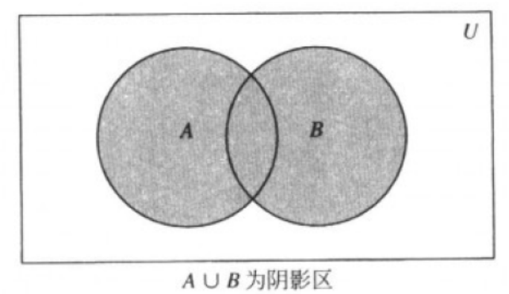
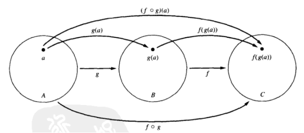
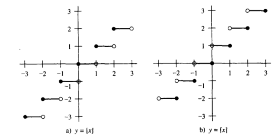

# 课前须知
> 评分细则:
跟信息论的相同，上课本前7章，期末60，作业32，迟交2分，满分4分，做了按时交最少3.5分，点名8分。

> [课程主页](https://faculty.ustc.edu.cn/flowice/zh_CN/zdylm/679091/list/index.htm):
https://faculty.ustc.edu.cn/flowice/zh_CN/zdylm/679091/list/index.htm

# 第一章 基础:逻辑与证明

## 1.1命题逻辑

### 罗素悖论
- 将集合分成两类,一类是集合A本身是A的一个元素, 即A∈A,另一类是集合A本身不是A的一个元素, 即A∉A。
- 现构造一个集合S:
- S={A|A∉A}也就是说S是由满足条件A∉A的那些A组成的一个新的集合。
- 我们要问:S是不是它自己的一个元素? 即S∈S,还是S∉S。
- 既不是S∈S,也不是S∉S, 这个悖论就是著名的罗素悖论。

### 命题（Proposition）
命题：是一个或真或假的陈述语句，但不能既真又假。
> 以下不是命题:（可判断真假的才是命题）
x+1＝2（含有变量无法判断真假），几点了？
仔细读这个。

- 命题变元：命题的字母表示，p, q, r, s, …
- 命题的真值（true value）：真命题的真值用“T”表示，假命题的真值用“F”来表示
- 命题逻辑（propositional logic）或命题演算（propositional calculus）：涉及命题的逻辑领域。

### 命题的否定
> 命题的否定（negation）：令p为一命题，则语句“不是p所说的情形”是另一个命题，称为p的否定，用“┐p”表示。命题“┐p”读为“非p”。

### 真值表和运算符
> 真值表（truth table）给出了命题真值之间的关系。

<div align="center">
 <table>
   <thead>
     <tr>
       <th>p</th>
       <th>¬p</th>
     </tr>
   </thead>
   <tbody>
     <tr>
       <td>T</td>
       <td>F</td>
     </tr>
     <tr>
       <td>F</td>
       <td>T</td>
     </tr>
   </tbody>
 </table>
</div>

- 运算符（operator）可以从已有命题构造新命题。有时可称为联接词（connective）。
- 非运算符： ┐
- 原子命题（ Atomic Proposition ）：不含逻辑运算符的命题，不可拆分<span id="yuanzimingti"></span>
- 复合命题（Compositional Proposition） ：用逻辑运算符组合命题构造出的新命题

### 合取（conjunction）
> 令p和q为命题。用p∧q表示这样一个命题：当p和q均为真命题时它为真，否则为假。命题p∧q称为p和q的合取。
注:***理解为集合运算交运算，有一个为假就为假*** 。

<div align="center">
 <table>
  <thead>
    <tr>
      <th>p</th>
      <th>q</th>
      <th>p∧q</th>
    </tr>
  </thead>
  <tbody>
    <tr>
      <td>T</td>
      <td>T</td>
      <td>T</td>
    </tr>
    <tr>
      <td>F</td>
      <td>T</td>
      <td>F</td>
    </tr>
    <tr>
      <td>T</td>
      <td>F</td>
      <td>F</td>
    </tr>
    <tr>
      <td>F</td>
      <td>F</td>
      <td>F</td>
    </tr>
  </tbody>
</table>
</div>

### 析取（disjunction）
> 令p和q为命题。用p∨q表示这样一个命题：当p和q均为假命题时它为假，否则为真。命题p∨q称为p和q的析取。
***注意:理解为同或或者集合中的并运算，有一个为真就为真***

<div align="center">
 <table>
  <thead>
    <tr>
      <th>p</th>
      <th>q</th>
      <th>p∨q</th>
    </tr>
  </thead>
  <tbody>
    <tr>
      <td>T</td>
      <td>T</td>
      <td>T</td>
    </tr>
    <tr>
      <td>F</td>
      <td>T</td>
      <td>T</td>
    </tr>
    <tr>
      <td>T</td>
      <td>F</td>
      <td>T</td>
    </tr>
    <tr>
      <td>F</td>
      <td>F</td>
      <td>F</td>
    </tr>
  </tbody>
</table>
</div>

### 异或（exclusive or）
> 令p和q为命题。p和q的异或，用p⊕q表示，是这样一个命题：当p和q中恰有一个为真时它为真，否则为假。

<div align="center">
 <table>
  <thead>
    <tr>
      <th>p</th>
      <th>q</th>
      <th>p⊕q</th>
    </tr>
  </thead>
  <tbody>
    <tr>
      <td>T</td>
      <td>T</td>
      <td>F</td>
    </tr>
    <tr>
      <td>F</td>
      <td>T</td>
      <td>T</td>
    </tr>
    <tr>
      <td>T</td>
      <td>F</td>
      <td>T</td>
    </tr>
    <tr>
      <td>F</td>
      <td>F</td>
      <td>F</td>
    </tr>
  </tbody>
</table>
</div>

### 蕴含（implication）
> 令p和q为命题。蕴含p→q是这样一个命题：当p为真而q为假时它为假，否则为真。p称为假设（或前提，前项），q称为结论（或推论）。一个蕴含有时也称为条件语句（conditional statement）
> >  ***注意：只有在p为真而q为假时， p→q才为假。如果p为假，则不管q的真值是什么， p→q都为真。***

<div align="center">
 <table>
  <thead>
    <tr>
      <th>p</th>
      <th>q</th>
      <th>p→q</th>
    </tr>
  </thead>
  <tbody>
    <tr>
      <td>T</td>
      <td>T</td>
      <td>T</td>
    </tr>
    <tr>
      <td>F</td>
      <td>T</td>
      <td>F</td>
    </tr>
    <tr>
      <td>T</td>
      <td>F</td>
      <td>T</td>
    </tr>
    <tr>
      <td>F</td>
      <td>F</td>
      <td>T</td>
    </tr>
  </tbody>
</table>
</div>

> 计算机语言“if then”和蕴含的区别“if 2+2=4 then x:=x+1”不是蕴含，因为包含未知参数，所以两个语句都不是命题，从而不是蕴含。

#### 蕴含的逆、倒置和反
- 蕴含： p→q
- 逆蕴含（converse implication）： q→p
- 倒置蕴含（contrapositive implication）: ┐q→ ┐p
- 反蕴含（inverse implication）： ┐p→ ┐q
  > 倒置蕴含和蕴含有相同的真值
  > 
  > 逆蕴含和反蕴含有相同的真值，但与蕴含的真值不同
- 等价（equivalent）：两个复合命题总是具有相同的真值时，我们称这两个命题等价

### 双蕴含（bi-imiplication）
> 令p和q为命题。双蕴含p↔q是这样一个命题：当p和q具有相同真值时它为真，否则为假。一个双蕴含有时也称为双条件语句（biconditional statement），可理解为p为q的充要条件。
> > ***可理解为异或的反取***

<div align="center">
 <table>
  <thead>
    <tr>
      <th>p</th>
      <th>q</th>
      <th>p↔q</th>
    </tr>
  </thead>
  <tbody>
    <tr>
      <td>T</td>
      <td>T</td>
      <td>T</td>
    </tr>
    <tr>
      <td>F</td>
      <td>T</td>
      <td>F</td>
    </tr>
    <tr>
      <td>T</td>
      <td>F</td>
      <td>F</td>
    </tr>
    <tr>
      <td>F</td>
      <td>F</td>
      <td>T</td>
    </tr>
  </tbody>
</table>
</div>

#### 双蕴含的含义
- 双蕴含p↔q恰在p→q和q→p均为真时为真。我们常用术语“p当且仅当q”来表示这一双蕴含。
- p↔q与(p→q) ∧(q→p)有完全相同的真值。
  > “当且仅当”结构在自然语言中很少使用，我们一般用相对简单的结构来表示。比如说，“你吃完饭才可以吃甜点”。双蕴含的部分含义是隐含的，这就造成了在有些情况下，自然语言的不精确性。而在数学上，双蕴含和单蕴含是有明确区分的。~~可能双蕴含在自然语言中是只有才，单蕴含是如果就~~
- 自然语言和逻辑的区别
  > 逻辑：p↔q= q↔p
  > 自然语言：不一定。如p：吃完饭；q：可以吃甜点

### 逻辑运算符的优先级

<div align="center">
 <table>
  <thead>
    <tr>
      <th>运算符</th>
      <th>优先等级</th>
    </tr>
  </thead>
  <tbody>
    <tr>
      <td>┐</td>
      <td>1</td>
    </tr>
    <tr>
      <td>∧</td>
      <td>2</td>
    </tr>
    <tr>
      <td>∨</td>
      <td>3</td>
    </tr>
    <tr>
      <td>→</td>
      <td>4</td>
    </tr>
    <tr>
      <td>↔</td>
      <td>5</td>
    </tr>
  </tbody>
</table>
</div>

***注:在容易混淆的情况下，尽量使用括号 。***

## 1.2命题逻辑的应用

### 逻辑运算和位运算
> - 计算机用字位（bit）来表示信息，每个字位有两个可能的值：0或1（0为F，1为T）；
> - 用字位来表示真值
> - 布尔变量（Boolean variable）
> - 字位运算（bit operation）：对应逻辑联接词
> - 位串（bit string）：0个或多个字位的序列，位串的长度就是它所含字位的个数；
> - 长度相同的两个位串的按位（bitwise）运算：运算结果的每个字位均由北运算的两个位串地对应字位经运算得到
> > 对于按位运算:
> > XOR为异或运算，两者有一个为1时，该位所得值为1，其他时候为0
> > OR为同或运算，两者全为0时，该位所得值为0，其他时候为1
> > AND为和运算，两者全为1时，该为值为1，其他时候为0
> > > ***需要注意的是按位运算的规则与二进制算法不太一样，按照上述异或，同或和合取时候的真值表来理解更好***

### 命题逻辑的应用-翻译语言的句子
- 由于语言的二义性，需要把句子译成逻辑表达式以消除
歧义，有时需要在句子含义基础上做一些合理的假设
  > 例1:“只有你主修计算机科学或不是新生，才可以从校园网访问因特网”
  > 
  >  a：你从校园网访问因特网；
  > 
  >  c：你主修计算机科学；
  >
  > f：你是一个新生；
  > 
  > a↔(c ∨ ┐f)
  > 
  > 例2:“除非你已满16周岁，否则只要你身高不足4英尺就不能乘公园滑行铁道游乐车”
  > 
  > q：你能乘公园滑行铁道游乐车；
  > 
  > r：你身高不足4英尺；
  >
  > s：你已满16周岁；
  > 
  > (r ∧ ┐s)→┐q

### 系统规范说明（~~感觉不重要~~）

- 在说明硬件系统和软件系统时，把自然语言语句翻译成逻辑表达式是很重要的一部分。这些说明可以作为系统开发的基础。
- 系统规范说明不应该存在冲突，因此，表示这些规范说明的命题表达式应该是一致的。
- 也就是说，对表达式中的各个变量，必然有一个真值赋值使所有表达式为真。（自洽的）

### bool搜索和逻辑电路（略）

## 1.3 命题等价

- 永真式（tautology，重言式）：无论其中出现的原子命题的真值是什么，复合命题的真值永远是真；
- 矛盾（contradiction）：真值永远为假的复合题；
- 可能式（contingency）：既不是永真式，又不是矛盾的命题。
例:`p∨┐p` 为永真式，`p∧┐p` 为矛盾。

<div align="center">
 <table>
  <thead>
    <tr>
      <th>p</th>
      <th>┐p</th>
      <th>p∨┐p</th>
      <th>p∧┐p</th>
    </tr>
  </thead>
  <tbody>
    <tr>
      <td>T</td>
      <td>F</td>
      <td>T</td>
      <td>F</td>
    </tr>
    <tr>
      <td>F</td>
      <td>T</td>
      <td>T</td>
      <td>F</td>
    </tr>
  </tbody>
</table>
</div>

### 重言式的性质

- 任何两个重言式的合取、析取、蕴含或双蕴含，仍然是一个重言式。（两个为真命题上述运算也全为真，**矛盾没有该性质**）
   > - [x] 由简单的重言式可构造出复杂的重言式
   > - [x] 由重言式使用公认的规则可以产生许多有用等价式和蕴含式
- 一个重言式，对同一[原子命题](#yuanzimingti)都用任何原子命题/复合命题置换，其结果仍为一重言式。（可以理解为用一个符合命题或者一个单独命题替换掉原有重言式中的某个单独子命题，但是不能替换原有重言式中的某个复合命题）
  > - [x] 置换时被替换的是原子命题，而不能是整个复合命题；
  > - [x] 置换时必须对同一原子命题处处替换以同一公式；
  > > - 例如：可用(r∨s)来替换(p∨¬p)∨q中的p，结果仍是重言式；
  > > - 但若用(r∨s)替换(p∨¬p)；则不能保持重言式；用(r∨s)只替换一处p得到的(r∨s)∨¬p∨q也不是重言式
- 对于矛盾式也有类似的性质

###  逻辑等价（logical equivalences)

#### 定义
- 如果p↔q是永真式，命题p和q称为是逻辑等价的，用记号p≡q来表示，有时也用p⇔q来表示；
  > - [x] p⇔q与p↔q是两个概念（前者表示两个命题之间的关系，后者是一个命题，有对应真值）；
  > - [x] 判定两个命题是否等价：使用真值表（其实这个在推不出来，并且在原子命题数少时非常好用，比如证明p∨(q∧r) ≡ (p∨q)∧(p∨r)时可以用）
  > > - [ ] 涉及n个原子命题的复合命题，需要2n行
  > > - [ ] 当n较大时，真值表方法行不通
  > - [x] 判定两个命题是否等价：使用已建立的等价关系来构造其他等价关系
  > > - [ ] 复合命题中的一个命题可以用与它逻辑等价的命题替换，而不改变复合命题的真值（***注:此时的命题替换与重言式中的命题置换不一样***）
  > - [x] 德摩根定律： ┐(p∨q) ≡ ┐p∧┐q

<div align="center">
  <table>
   <thead>
     <tr>
       <th>p</th>
       <th>q</th>
       <th>p∨q</th>
       <th>┐(p∨q)</th>
       <th>┐p</th>
       <th>┐q</th>
       <th>┐p∧┐q</th>
     </tr>
   </thead>
   <tbody>
     <tr>
       <td>T</td>
       <td>T</td>
       <td>T</td>
       <td>F</td>
       <td>F</td>
       <td>F</td>
       <td>F</td>
     </tr>
     <tr>
       <td>T</td>
       <td>F</td>
       <td>T</td>
       <td>F</td>
       <td>F</td>
       <td>T</td>
       <td>F</td>
     </tr>
     <tr>
       <td>F</td>
       <td>T</td>
       <td>T</td>
       <td>F</td>
       <td>T</td>
       <td>F</td>
       <td>F</td>
     </tr>
     <tr>
       <td>F</td>
       <td>F</td>
       <td>F</td>
       <td>T</td>
       <td>T</td>
       <td>T</td>
       <td>T</td>
     </tr>
   </tbody>
 </table>
</div>

#### 重要的等价关系（很重要）
> ***注:以下表中的等价关系是可以直接用不用推导的，其他的需要自行推导***

> ***从下面的表格不难看出来，五种基本运算符（合取，析取，否定，蕴含，双蕴含）之间是可以互相表示的，且每一种运算符最少要用2种其他的运算符表示。***

##### 等价表
<div align="center">
  <h6><strong>逻辑等价式</strong></h6>
  <table>
  <thead>
    <tr>
      <th>等价式</th>
      <th>名称</th>
    </tr>
  </thead>
  <tbody>
    <tr>
      <td>p∧T≡p<br>p∨F≡p</td>
      <td>恒等律</td>
    </tr>
    <tr>
      <td>p∨T≡T<br>p∧F≡F</td>
      <td>支配律</td>
    </tr>
    <tr>
      <td>p∨p≡p<br>p∧p≡p</td>
      <td>幂等律</td>
    </tr>
    <tr>
      <td>┐(┐p)≡p</td>
      <td>双重否定律</td>
    </tr>
    <tr>
      <td>p∨q≡q∨p<br>p∧q≡q∧p</td>
      <td>交换律</td>
    </tr>
    <tr>
      <td>(p∨q)∨r≡p∨(q∨r)<br>(p∧q)∧r≡p∧(q∧r)</td>
      <td>结合律</td>
    </tr>
    <tr>
      <td>p∨(q∧r)≡(p∨q)∧(p∨r)<br>p∧(q∨r)≡(p∧q)∨(p∧r)</td>
      <td>分配律</td>
    </tr>
    <tr>
      <td>┐(p∧q)≡┑p∨┑q<br>┐(p∨q)≡┑p∧┑q</td>
      <td>德·摩根律</td>
    </tr>
    <tr>
      <td>p∨(p∧q)≡p<br>p∧(p∨q)≡p</td>
      <td>吸收律</td>
    </tr>
    <tr>
      <td>p∨┑p≡T<br>p∧┑p≡F</td>
      <td>否定律</td>
    </tr>
  </tbody>
</table>
 <h6><strong>条件命题的逻辑等价式</strong></h6>
 <table>
  <thead>
    <tr>
      <th>逻辑等价式</th>
      <th>常用程度</th>
    </tr>
  </thead>
  <tbody>
    <tr>
      <td>p→q≡┑p∨q</td>
      <td>✔</td>
    </tr>
    <tr>
      <td>p→q≡┑q→┑p</td>
      <td>✔✔✔</td>
    </tr>
    <tr>
      <td>p∨q≡┑p→q</td>
      <td>✔</td>
    </tr>
    <tr>
      <td>p∧q≡┑(p→┑q)</td>
      <td>✔</td>
    </tr>
    <tr>
      <td>┑(p→q)≡p∧┑q</td>
      <td>✔</td>
    </tr>
    <tr>
      <td>┑(p→q)≡p∧┑q</td>
      <td>✔</td>
    </tr>
    <tr>
      <td>(p→q)∧(p→r)≡p→(q∧r)</td>
      <td>✔✔</td>
    </tr>
    <tr>
      <td>(p→r)∧(q→r)≡(p∨q)→r</td>
      <td>✔✔</td>
    </tr>
    <tr>
      <td>(p→q)∨(p→r)≡p→(q∨r)</td>
      <td>✔✔</td>
    </tr>
    <tr>
      <td>(p→r)∨(q→r)≡(p∧q)→r</td>
      <td>✔✔</td>
    </tr>
  </tbody>
</table>
<h6><strong>双条件命题的逻辑等价式</strong></h6>
 <table>
  <thead>
    <tr>
      <th>逻辑等价式</th>
      <th>常用程度</th>
    </tr>
  </thead>
  <tbody>
    <tr>
      <td>p↔q≡(p→q)∧(q→p)</td>
      <td>✔✔✔</td>
    </tr>
    <tr>
      <td>p↔q≡┑p↔┑q</td>
      <td>✔✔</td>
    </tr>
    <tr>
      <td>p↔q≡(p∧q)∨(┑q∧┑p)</td>
      <td>✔✔</td>
    </tr>
    <tr>
      <td>┑(p↔q)≡p↔┑q</td>
      <td>✔✔</td>
    </tr>
  </tbody>
</table>
</div>

#####  德·摩根律的扩展

$$┑(p_1 ∨ p_2 ∨...∨p_n)≡(┑p_1 ∧┑ p_2 ∧...∧┑p_n)$$

$$┑(p_1 ∧ p_2 ∧...∧p_n)≡(┑p_1 ∨┑ p_2 ∨...∨┑p_n)$$

$$\begin{equation}
\begin{aligned}
\lnot(\bigvee^n_{i=1} p_i) &\equiv \bigwedge^n_{i=1} \lnot p_i 
\end{aligned}
\end{equation}$$

$$\begin{equation}
\begin{aligned}
\lnot(\bigwedge^n_{i=1} p_i) &\equiv \bigvee^n_{i=1} \lnot p_i
\end{aligned}
\end{equation}$$

<!--\begin{equation}：这是LaTeX中用于创建数学公式块的命令。它使公式以单独的行内显示，并附带一个自动编号。

\begin{aligned}：这是LaTeX中用于创建多行数学公式的环境。在这个环境中，可以使用&来对齐公式中的不同部分，并且可以使用\\来分隔不同的行。

\lnot：这是LaTeX中用于表示逻辑非（not）的符号。

\bigvee：这是LaTeX中用于表示逻辑或（logical OR）的符号，其中\big用于显示大的逻辑运算符。

\bigwedge：这是LaTeX中用于表示逻辑与（logical AND）的符号，同样，\big用于显示大的逻辑运算符。

\equiv：这是LaTeX中用于表示逻辑等价（logical equivalence）的符号，表示左侧和右侧的表达式是等价的。-->

### 逻辑等价的性质，和数学中等号性质类似

#### 性质
1. 自反性： p⇔p
2. 对称性： 若p⇔q，则q⇔p
3. 传递性：若p⇔q， q⇔r，则p⇔r

#### 判定两个命题是否等价（考点）
- 使用已建立的等价关系来构造其他等价关系
  > 证明┐(p∨(┐p∧q) ≡ ┐p∧┐q
  >
  > 证明过程:
  > ┐(p∨(┐p∧q)⇔┐p∧┐(┐p∧q)⇔┐p∧(p∨┐q)⇔(┐p∧p)∨(┐p∧┐q)⇔F∨(┐p∧┐q)⇔┐p∧┐q

  > 证明 (p∧q)→(p∨q)为永真式
  >
  > ***思路:即证明等价为T***
  > 
  > 证明过程:
  > 
  > (p∧q)→(p∨q)⇔┐(p∧q)∨(p∨q)⇔(┐p∨┐q)∨(p∨q)⇔(p∨┐p)∨(q∨┐q)⇔T∨T⇔T

### 命题的可满足性
- 一个复合命题称为可满足的：如果存在一个对其变元的
真值赋值使其为真（永真式+可能式）
  > 判断可满足性
  > - [x] 真值表
  > - [x] 是否逻辑等价于矛盾式
  > - [x] 逻辑推理

#### 数独求解
- [ ] 命题p(i,j,n)：当数n位于第i行第j列的单元时为真
- [ ] 数独的解需满足（以下所有的合取）：
  > - [x] 已知数对应单元的p(i,j,n)为真，如p(1,7,4)
  > - [x] 每一行包含了每一个数 $\bigwedge\limits^9_{i=1}  \bigwedge\limits^9_{n=1}  \bigvee\limits^9_{j=1} p(i,j,n)$
  > - [x] 每一列包含了每一个数 $\bigwedge\limits^9_{j=1}  \bigwedge\limits^9_{n=1}  \bigvee\limits^9_{i=1} p(i,j,n)$
  > - [x] 每一个九宫格包含了每一个数 $\bigwedge\limits^2_{r=0}  \bigwedge\limits^2_{s=1} \bigwedge\limits^9_{n=1} \bigvee\limits^9_{i=1} \bigvee\limits^9_{j=1} p(3r+i,3s+j,n)$
  > - [x] 没有一个单元包含多余一个数 $p(i,j,n)→\lnot p(3r+i,3s+j,n)$

## 1.4 谓词和量词

### 谓词

#### 定义

- 简单认为是用于判断性质的语句或者符号，比如“是”，“>”等。

#### 命题函数

- 含变量的语句，在变量值未知时，语句既不为真，也不为假：“x>3”，“x=y+3”，“x+y=z”
- 命题函数（propositional function）：谓词（predicate）和变量的组合，一般用大写英文表示，与命题（小写字母）区分开，当命题函数中的未知参数赋值以后就是命题，可以判断其真值。
- $P(x_1, x_2, …, x_n)$ 表示命题函数P在n元组（n-tupie） $(x_1, x_2, …, x_n)$ 的值，P也称为谓词，用来描述个体的属性以及个体之间的关系；
  > P(x)：x>3
  >
  > Q(x,y)：x=y+3
  >
  > R(x,y,z)：x+y=z

### 量词
#### 定义
- 量化（quatification）：从命题函数产生命题
  > - 全称量化∀ （universal quatification）：Any首字母的倒写
  > - 存在量化∃ （existential quatification）：Exist首字母的反写
- 谓词演算（predicate calculus）：与谓词和量词相关的逻辑领域
- 论域（domain of discourse）：命题函数中变量的定义域

### 全称量化

#### 定义

- P(x)的全称量化是命题“P(x)对x在其论域的所有值为真”，记为∀xP(x)。其中∀称为全称量词。
- 命题∀xP(x)表示为“对所有x，P(x)”或“对每个x，P(x)”。
   > 当论域中的所有元素可以一一列出时 $∀xP(x) ≡ P(x_1)∧P(x_2)∧…∧P(x_n)$
   
   > 使用量词时，论域是很重要的
   
   > 反例（counterexample）：论域中使P(x)为假的x的取值

#### 举例
> P(x)：x+1>x 
> 
> 论域：实数集合
> 
> ∀xP(x)=T
> 
> P(x)：x2>0
> 
> 论域：整数
> 
> 反例：x=0

### 存在量化

#### 定义

- P(x)的存在量化是命题“论域中存在一个元素x使P(x)为真”，记为∃xP(x)。其中∃称为存在量词。（存在一个但也可以不止一个）
- 命题∃xP(x)表示为“有一个x使得P(x)”或“对某个x，P(x)”。
   > 当论域中的所有元素可以一一列出时 $∃xP(x) ≡ P(x_1)∨P(x_2)∨…∨P(x_n)$
   > 
   > 使用量词时，论域是很重要的

#### 举例
> P(x)：x>3
>
> 论域：实数集合
> 
> ∃xP(x)=T

### 量词总结
<div align="center">
 <table>
  <thead>
    <tr>
      <th>语句</th>
      <th>何时为真?</th>
      <th>何时为假?</th>
    </tr>
  </thead>
  <tbody>
    <tr>
      <td>∀xP(x)</td>
      <td>对每一个x，P(x)都为真</td>
      <td>有一个x，使P(x)都为假</td>
    </tr>
    <tr>
      <td>∃xP(x)</td>
      <td>有一个x，使P(x)都为真</td>
      <td>对每一个x，P(x)都为假</td>
    </tr>
  </tbody>
</table>
</div>

- 唯一性量词（∃!或 $∃_1$ ）：存在唯一的x使P(x)为真
  > ∃!xP(x)
- 量词的优先级：高于合取/析取等逻辑运算符
  > ∃xP(x)∧Q(x)=(∃xP(x))∧Q(x)

### 绑定变量

- 当量词作用于变量x或给这一变量赋值时，我们说此变量的这一次出现为 ___绑定（bound）___ 的；
- 没有被量词绑定或设置为与某一特定值相等的变量出现为 ___自由（free）___ 的；
  > - [x] 出现在命题函数中的所有变量必须通过绑定，才能把此命题函数转变成命题
- 逻辑表达式中应用量词的部分称为这个量词的 ___作用域（scope）___。
  > - [x] 判定一个变量是否自由：在指定这个变量的公式中，变量在所有量词的作用域之外
  > > 例子：∃xQ(x,y) ∃x(P(x)∧Q(x))∨∀xR(x)(此时前后两个x变量的作用域不一样)
  > - [x] ___只要作用域不重叠，相同的字母可以用于表示被不同量词绑定的变量___

### 量词的否定

- 全称量词的否定
  > 例子
  > 
  > P(x)：x学过一门微积分课
  > 
  > 论域：全班学生
  > 
  > ∀xP(x)：班上每个学生都学过一门微积分课
  > 
  > ┐(∀xP(x))：并非班上每个学生都学过一门微积分课
  > 
  > ∃x┐P(x)：班上有个学生没有学过微积分课
  > 
  > ┐(∀xP(x))≡ ∃x┐P(x)

<div align="center" id="not">
 <h6><strong>量词的否定</strong></h6>
 <table>
  <thead>
    <tr>
      <th>否定</th>
      <th>等价语句</th>
      <th>何时为真?</th>
      <th>何时为假?</th>
    </tr>
  </thead>
  <tbody>
    <tr>
      <td>┑∃xP(x)</td>
      <td>∀x┑P(x)</td>
      <td>对每个x，P(x)都为假</td>
      <td>有x，使P(x)都为真</td>
    </tr>
    <tr>
      <td>┑∀xP(x)</td>
      <td>∃x┑P(x)</td>
      <td>有x，使P(x)都为假</td>
      <td>对每个x，P(x)都为真</td>
    </tr>
  </tbody>
</table>
</div>

### 涉及量词的逻辑等价(重点考察，易错点)
#### 定义
- 涉及谓词和量词的逻辑等价：当且仅当无论用什么谓词代入这些语句，也无论为这些命题函数里的变量指定什么论域(即变量x所有可以存在的论域，而不是仅限某个论域)，它们都有相同的真值。用S≡T表示。
  > 证明：┑∀x(P(x)→Q(x))和∃x(P(x)∧┑Q(x))是逻辑等价的（始终采用同一个论域）
  >
  > 假设┑∀x(P(x)→Q(x))为假。这说明对于论域中的任何元素x，都满足条件P(x)→Q(x)。接下来证明∃x(P(x)∧┑Q(x))为假，即不存在一个元素x使得P(x)∧┑Q(x)为真。
  >
  > 假设反证法，假设∃x(P(x)∧┑Q(x))为真，即存在元素x使得P(x)∧┑Q(x)为真。然后，使用∀x(P(x)→Q(x))为真的前提来构造一个矛盾。
  >
  > 选择一个特定的元素a，P(a)∧┑Q(a)为真，可知P(a)和┑Q(a)为真，Q(a)为假，由于∀x(P(x)→Q(x))为真，从而得到P(a)必须为假才行。
  >
  > 这导致了矛盾，因此假设∃x(P(x)∧┑Q(x))为真是不正确的。因此，根据反证法的证明，∃x(P(x)∧┑Q(x))为假。
  >
  > 这表明∀x(P(x)→Q(x))和∃x(P(x)∧┑Q(x))之间不存在反例，因此它们是逻辑等价的。

#### 常见的量词的逻辑等价

<div align="center">
 <table>
  <thead>
    <tr>
      <th>量词的逻辑等价</th>
    </tr>
  </thead>
  <tbody>
    <tr>
      <td>∀xP(x) ≡ P(x₁)∧P(x₂)∧…∧P(xₙ)</td>
    </tr>
    <tr>
      <td>∃xP(x) ≡ P(x₁)∨P(x₂)∨…∨P(xₙ)</td>
    </tr>
    <tr>
      <td>∀x(P(x)∧q) ⇔ ∀xP(x)∧q</td>
    </tr>
    <tr>
      <td>∀x(P(x)∨q) ⇔ ∀xP(x)∨q</td>
    </tr>
    <tr>
      <td>∃x(P(x)∧q) ⇔ ∃xP(x)∧q</td>
    </tr>
    <tr>
      <td>∃x(P(x)∨q) ⇔ ∃xP(x)∨q</td>
    </tr>
    <tr>
      <td>∀x(P(x)∧Q(x)) ⇔ ∀xP(x)∧∀xQ(x)</td>
    </tr>
    <tr>
      <td>∃x(P(x)∨Q(x)) ⇔ ∃xP(x)∨∃xQ(x)</td>
    </tr>
  </tbody>
</table>
</div>

> - [x] 为了便于记忆，可以这么理解，由于命题q的真值与x取值没有关系，所以P(x)∧(∨)q对于论域中的任意x而言，其实发生变化的只有P(x)的真值，所以将q提取出来没有问题。
>
> - [x] ***但是考虑以下关系∀x(P(x)→q) ⇔ ∀xP(x)→q，这个是有问题的，假设∀xP(x)为假时，后面的量词命题始终为真，但是有可能存在x=a，使得P(x)为真（∀xP(x)为假不代表不存在x使得P(x)为真）。***
>
> - [x] ***假设q为假，此时P(x)→q为假，说明存在x=a使得P(x)→q为假，故∀x(P(x)→q)为假。这个是矛盾的，所以可证明是有问题的*** 
>
> - [x] 同时由于对于∀x(P(x)∧Q(x))而言，本来是同一个论域中的x变量，P(x)和Q(x)的真值会同时变化，假设对于论域某一个x=a而言，P或Q为假，则前部分命题表达式为假，同时由于为同一个论域，所以a仍在域内，故右边命题也为假。
>
> - [x] 同理也可知当前面这个命题表达式为真时，对于论域中的x，P(x)和Q(x)均为真，所以对于同一论域，后面也为真。
> 
> - [x] ***这个时候考虑关系∀x(P(x)∨Q(x)) ⇔ ∀xP(x)∨∀xQ(x),这个则是有问题的，假设前者表达式为真，则说明对于每一个x而言，P(x)或Q(x)为真，但是此时x不能保证P(x)和Q(x)同时为真。***
>
> - [x] ***假设x=a时，P(x)为真，Q(x)为假，而当x=b时，P(x)为假，Q(x)为真，就算只有这两种情况的特例，其他x都使得P(x)和Q(x)同时为真，这个时候前面的命题为真。***
>
> - [x] ***但是∀xP(x)和∀xQ(x)均为假（分别存在b,a使得P(x)和Q(x)为假），则∀xP(x)∨∀xQ(x)为假，所以两个量词命题是不等价的***
>
> - [x] 同时根据上述解释，可以明白∃x(P(x)∨Q(x)) ⇔ ∃xP(x)∨∃xQ(x)，而 ***∃x(P(x)∧Q(x)) ⇔ ∃xP(x)∧∃xQ(x)有问题，也可以举例类似上述的矛盾，假设前者为假，则没有一个x可以让P(x)∧Q(x)同时为真。***
>
> - [x] ***但是可以存在x=a使得P(x)为真，Q(x)为假，x=b使得P(x)为假，Q(x)为真，所以此时可看出来∃xP(x)和∃xQ(x)均为真（分别存在a,b使得P(x)和Q(x)为真），后面表达式为真。***
>
> - [x] ***从上述不难发现，反证法，取特定值法和假设法在证明该问题时，尤其好用。*** 

### 翻译语句为逻辑表达式
- 例：使用谓词和量词表达语句“班上的每个学生都学过积分课”
 > C(x):x学过微积分课
 >
 > 论域：全班同学
 >
 > ∀xC(x):班上每个学生都学过微积分课
 >
 > 或者
 >
 > Q(x,y):学生x学过课程y
 > 
 > S(x):x是班上的学生
 > 
 > 论域为：所有人，所有课程
 > 
 > ∀x(S(x)→Q(x,微积分))
- 例：
  > P(x):x是只蜂鸟
  >
  > Q(x):x是大的
  >
  > R(x):x以蜜为生
  >
  > S(x):x五彩斑斓
  >
  > 论域:所有鸟
  >
  > 所有蜂鸟都五彩斑斓:∀x(P(x)→S(x))
  >
  > 没有大鸟以蜜为生：┑∃x(Q(x)∧R(x))
  >
  > 不以蜜为生的鸟都色彩单调:∀x(┑R(x)→┑S(x))
  >
  > 蜂鸟都是小鸟:∀x(P(x)→┑Q(x))

## 1.5 嵌套量词
### 嵌套量词(Nested Quantifiers)
> 定义:出现在其他量词的作用域中的量词。
>
> ~~标注：嵌套量词中的量词要从左到右顺序进行读取。一般这样能得到正确语句。~~
> > 例：
> >
> > ∀x∀y(x+y=y+x)
> >
> > ∀x∃y(x+y=0)
> >
> > ∀x∀y∀z(x+(y+z)=(x+y)+z)
> >
> > ∀x∀y((x>0)∧(y<0)→(xy<0))

### 循环量化思考
#### 定义
> 借助嵌套循环来思考多个变量使用量词的情况。

<div align="center">
 <p align="center"><span>两个变量的量化</span></p>
 <table>
  <tr>
    <th>语句</th>
    <th>何时为真?</th>
    <th>何时为假?</th>
  </tr>
  <tr>
    <td>∀x∀yP(x,y)<br>∀y∀xP(x,y)</td>
    <td>对每一对x,y,P(x,y)均为真</td>
    <td>有一对x,y使得P(x,y)为假</td>
  </tr>
  <tr>
    <td>∀x∃yP(x,y)</td>
    <td>对每个x，都有y使得P(x,y)为真</td>
    <td>有x,使得P(x,y)对于每个y总是假</td>
  </tr>
  <tr>
    <td>∃y∀xP(x,y)</td>
    <td>有一个x,使得P(x,y)对于所有y均为真</td>
    <td>对于每个x都有y使得P(x,y)为假</td>
  </tr>
  <tr>
    <td>∃x∃yP(x,y)<br>∃y∃xP(x,y)</td>
    <td>有一对x,y使得P(x,y)为真</td>
    <td>对每一对x,y,P(x,y)均为假</td>
  </tr>
</table>
</div>

#### 举例
> Q(x,y,z):x+y=z
> 
> 论域：所有实数
> 
> ∀x∀y∃zQ(x,y,z)= T
>
> > 对于所有实数x和所有实数y，有实数z，使得x+y=z
> 
> ∃z∀x∀yQ(x,y,z)= F
>
> > 有实数z使得对所有实数x和所有实数y，x+y=z

### 量词的顺序
> 除非所有量词均为全称量词或存在量词，否则量词的顺序是很重要的。

#### 举例
> P(x,y):x+y=y+x
>
> 论域：所有实数
>
> ∀x∀yP(x,y)= T
>
> Q(x,y):x+y=0
>
> 论域：所有实数
>
> ∃y∀xQ(x,y)= F
>
> > 有个实数y能使Q(x,y)对于每一个实数x成立
>
> ∀x∃yQ(x,y)= T
> > 对每个实数x都有一个实数y使Q(x,y)成立

### 翻译涉及嵌套量词的语句
- [x] 写出表达式中的量词和谓词的含义, ***注意：要分清楚全称量词和存在量词***
- [x] 用简单的句子来表达这个含义

#### 举例
> ∃x∀y∀z((F(x,y)∧F(x,z)∧F(y≠z))→┑F(y,x))
>
> F(a,b):a和b是朋友
>
> 论域：学校中所有的学生
>
> *有个学生，他的朋友之间都不是朋友*

>  将语句“每个人都恰有一个最好的朋友”翻译成逻辑表达式
>
> B(x,y):y是x的最好的朋友
>
> 论域：所有人
>
> x恰有一个最好的朋友意味着有一个人y是x的最好的朋友，而且，对每个人z，若果z不是y，那么z不是x的最好的朋友。
>
> ∀x∃y(B(x,y)∧∀z((z≠y)→┑B(x,z)))

> 将语句“有一个妇女已搭乘过世界上每一条航线上的航班”翻译成逻辑表达式
>
> P(w,f)：w搭乘过f
>
> Q(f,a)：f是a上的航班
>
> 论域：所有妇女，所有航班，所有航线
>
> ∃w∀a∃f(P(w,f)∧Q(f,a))

### 将数学语句翻译成逻辑表达式
#### 举例
> 将语句“两个正整数的和是正数”翻译成逻辑表达式。
>
> x：正整数
>
> y：正整数
>
> 论域：全体整数
>
> ∀x∀y((x>0)∧(y>0)→(x+y>0))

> 将语句“每个实数（除了零）都有乘法逆元”翻译成逻辑表达式。
>
> x：实数，x≠0
>
> 论域：实数
>
> ∀x((x≠0))→∃y(xy=1)

### 否定嵌套量词
#### 定义
> 可以通过连续的应用否定单个量词的规则来否定带嵌套量词的语句
[量词的否定表格见上](#not)

#### 举例
> 使用量词表示语句“没有一个妇女已搭乘过世界上每一条航线上的航班”
> P(w,f)：w搭乘过f
>
> Q(f,a)：f是a上的航班
>
> 论域：所有妇女,所有航班,所有航线
>
> $┑∃w∀a∃f(P(w,f)∧Q(f,a))$
> $\equiv ∀w┑∀a∃f(P(w,f)∧Q(f,a))$
> $\equiv ∀w∃a┑∃f(P(w,f)∧Q(f,a))$
> $\equiv ∀w∃a∀┑f(P(w,f)∧Q(f,a))$
> $\equiv ∀w∃a∀f(┑P(w,f)∨┑Q(f,a))$

## 1.6 推理规则
### 相关定义
- 定理（theorem）：可以被证明为真的命题。
- 证明（proof）：用一系列命题来证明一条定理为真，这些命题就形成一项论证，称为证明。
- 公理（axioms）：或称为公设（postulates），是关于数学结构的基本假设。
- 推理规则（rules of inference）：是从其他断言得出结论所用的方法，用来把证明的各个步骤联系起来。
- 引理（lemma）：在其他定理证明中所用的简单定理。
- 推论（corollary）：从已经证明了的定理直接证实的命题。
- 猜想（conjecture）：真值未知的命题。

### 推理规则
#### 假言推理
> 假言推理（modus ponens）：又称分离规则（law of detachment），以重言式(p∧(p→q))→q为基础的推理规则。假言推理是说，若蕴含式及其前提为真，则这个蕴含式的结论为真。
> > 一般推理过程如下
```math
p为真
p→q为真
∴q为真
```
#### 假言推理的例子
> 例1
> > 假定蕴含式“若今天下雪，则将去滑雪”和它的前件“今天正在下雪”都为真。那么，根据假言推理，得出蕴含式的后件“将去滑雪”为真。

> 例2
> > 蕴含式“若 n被3整除，则n²被9整除”为真。所以，若n被3整除，则根据假言推理得出n²被9整除。

#### 一些基本的推理规则

<div align="center">
 <p align="center"><span>推理规则</span></p>
 <table>
  <tr>
    <th>推理规则</th>
    <th>永真式</th>
    <th>名称</th>
  </tr>
  <tr>
    <td>p<br>p→q<br>∴q</td>
    <td>(p∧(p→q))→q</td>
    <td>假言推理</td>
  </tr>
  <tr>
    <td>┐q<br>p→q<br>∴┐p</td>
    <td>(┐p∧(p→q)→┐p)</td>
    <td>取拒式</td>
  </tr>
  <tr>
    <td>p→q<br>q→r<br>∴p→r</td>
    <td>((p→q)∧(q→r))→(p→r)</td>
    <td>假言三段论</td>
  </tr>
  <tr>
    <td>p∨q<br>┐q<br>∴q</td>
    <td>((p∨q)∧┐q)→q</td>
    <td>析取三段式</td>
  </tr>
  <tr>
    <td>p<br>∴(p∨q)</td>
    <td>p→(p∨q)(p⇒(p∨q))</td>
    <td>附加律</td>
  </tr>
  <tr>
    <td>p∧q<br>∴p</td>
    <td>(p∧q)→p</td>
    <td>化简律</td>
  </tr>
  <tr>
    <td>p<br>q<br>∴p∧q</td>
    <td>((p)∧(q))→(p∧q)</td>
    <td>合取律</td>
  </tr>
  <tr>
    <td>p∨q<br>┐p∨r<br>∴q∧r</td>
    <td>((p∨q)∧(┐p∨r))→(q∧r)</td>
    <td>消解律</td>
  </tr>
</table>
</div>

### 假言三段论的例子
> 一般形如以下形式的论证为是假言三段论(hypothetical syllogism)
```math
p→q
q→r
∴p→r
```
#### 示例
> 说出在下列论证里使用哪个推理规则
> > 若今天下雨，则我们今天将不野餐。若我们今天不野餐，则我们明天将野餐。因此，若今天下雨，则我们明天将野餐。
> > 
> > p:今天下雨
> > 
> > q：我们今天将不野餐
> > 
> > r：我们明天将野餐

### 有效论证
- 若每当所有的前提都为真时，结论也为真，则这样的论证称为有效的。
 - [ ] 设 $p_1, p_2, …, p_n$ 和q是命题，当且仅当为 $(p_1∧p_2∧...∧p_n)→q$ 一重言式，称q为 $p_1, p_2, …, p_n$ 的有效结论，记为 $(p_1 ∧ p_2 ∧ … ∧ p_n)⇒q$ ；
 - [ ] 有效论证强调的是推理的有效性，而不在于结论是否正确：当在有效论证中用到一个或多个假命题时，该论证可能得出不正确的结论；
 - [ ] 当存在许多前提时，为了证明一个论证是有效的，就常常需要多个推理规则。
#### 示例
> 例证明：前提“今天下午没有出太阳并且今天比昨天冷”，“只有今天下午出太阳，我们才将去游泳”，“若我们不去游泳，则我们将乘独木舟游览”，以及“若我们乘独木舟游览，则我们将在黄昏时回家”，导致结论“我们将在黄昏时回家”。
> > p:今天下午出太阳
> >
> > q：今天比昨天冷
> >
> > r：我们将去游泳
> >
> > s：我们将乘独木舟游览
> > 
> > t：我们将在黄昏时回家

### 消解
- [ ] 消解（resolution）：基于以下永真式的推理规则，析取q∨r称为 ***消解式*** （resolvent）。
$$((p∨q)∧(┑p∨r))→(q∨r)$$
 - [x] 在计算机程序中经常使用的推理规则；
 - [x] 当r=F时，消解规则成为了析取三段论规则

> 例：使用消解证明假设“Jasmine在滑雪或没有下雪”和“下雪了或Bart在打曲棍球”蕴含结论“Jasmine在滑雪或Bart在打曲棍球。”
> > p:下雪了
> >
> > q: Jasmine在滑雪
> >
> > r: Bart在打曲棍球
> >
> > 假设为： ┐p∨q， p∨r ***消解得到： q∨r***

> 证明:(p∧q)∨r和r→s蕴含结论p∨s

### 谬误
- [ ] 肯定结论谬误（fallacy of affirming the conclusion）：命题[(p→q)∧q]→p不是重言式。
- [ ] 否定假设谬误（fallacy of denying the hypothesis）：命题[(p→q)∧┐p]→┐q不是重言式。
> 例：下面的论证是否有效？
>
> 若你做过本书的每一道练习，则你学习过离散数学。
>
> 你学习过离散数学。因此你做过本书的每一道练习。
>
> p:你做过本书的每一道练习
>
> q: 你学习过离散数学

### 带量词命题的推理规则

<div align="center">
 <table>
  <tr>
    <th>推理规则</th>
    <th>名称</th>
  </tr>
  <tr>
    <td>∀xP(x)<br>∴P(c)</td>
    <td>全称实例</td>
  </tr>
  <tr>
    <td>P(x), 任意c<br>∴∀xP(x)</td>
    <td>全称引入</td>
  </tr>
  <tr>
    <td>∃xP(x)<br>∴P(c), 对某个元素c</td>
    <td>存在实例</td>
  </tr>
  <tr>
    <td>P(c), 对某个元素c<br>∴∃xP(x)</td>
    <td>存在引入</td>
  </tr>
</table>
</div>

> 例1:
> > 证明前提“在这个班上的某个学生没有读过书”和“班上的每个人都通过了第一门考试”蕴含结论“通过考试的某个人没有读过书”。
> > 
> > C(x):x在这个班中
> >
> > B(x):x读过书了
> >
> >  P(x):x通过了第一门考试
> >
> > 论域：所有学生

- 数学论证中常常既使用命题推理规则，又使用量词推理规则。
	- [x] 全称例示和假言推理结合:∀x(P(x)→Q(x))∨P(c) → Q(c)

> 例2:
> > P(x)：x是大学生；Q(x)：x是青年；c：参加大运会的运动员
> > 所有大学生都是青年:∀x(P(x)→Q(x)) ；
> >
> > 参加大运会的运动员是大学生:P(c)；
> >
> > 所以，参加大运会的运动员是青年:Q(c)。

- 全称生成规则在定理证明中，有时候不明确指出。
	- [x] 若a，b是正实数，则a>b推出 $a^2>b^2$ ；

### 使用推理规则的步骤
> 例题：用推理规则证明:如果∀x(P(x)∨Q(x))和∀x(┑Q(x)∨S(x)),∀x(R(x)→┑S(x))和∃x┑P(x)为真，则∃x┑R(x)为真

> 证明如下：
> 1. ∃x┑P(x)(前提引入)
> 2. ┑P(c)(存在实例，由(1))
> 3. ∀x(P(x)∨Q(x))(前提引入)
> 4. P(c)∨Q(c)(全称实例，由(3))
> 5. Q(c)(析取三段式，由(2)(4))
> 6. ∀x(┑Q(x)∨S(x))(前提引入)
> 7. ┑Q(c)∨S(c)(全称实例，由(6))
> 8. S(c)(析取三段式，由(5)(7))
> 9. ∀x(R(x)→┑S(x))(前提引入)
> 10. R(c)→┑S(c)(全称实例，由(9))
> 11. ┑R(c)(取拒式，由(8)(10))
> 12. ∃x┑R(x)(存在引入，由(11))

## 1.7 证明导论

### 证明定理的方法
- [x] 直接证明（direct proof）
- [x] 间接证明（proof by contraposition）
- [x] 空证明（vacuous proof）
- [x] 平凡证明（trivial proof）
- [x] 归谬证明（proof by contradiction）
- [x] 分情形证
- [x] 等价性证明（proof of equivalence）
### 直接证明
- [x] 直接证明：通过证明若p为真则q也必然为真，来证明蕴含式p→q为真；

> 例：整数n是偶数，如果存在一个整数k是的n=2k；整数n是奇数，如果存在一个整数k是的n=2k+1。

> 例：给出定理“若n是奇数，则n2是奇数”的直接证明

### 间接证明（反证法）
- [x] 间接证明：通过证明逆否命题┐q→┐p ，来证明蕴含式p→q；
 
> 例：给出定理“若3n+2是奇数，则n是奇数”的间接证明

### 空证明和平凡证明
- [x] 空证明：通过证明p为假，来证明蕴含式p→q为真；
	- [ ] 主要用于证明一些定理的特殊情况 
 
> 例：证明命题P(0)为真，其中P(n)是命题函数“ $若n>1，则n^2>n$ ”

- [x] 平凡证明：通过证明q为真，来证明蕴含式p→q为真；
	- [ ] 主要用于证明定理的特殊情形以及数学归纳法中
 
> 例：设P(n)是命题“若a和b是满足的a≥b的正整数，则 $a^n ≥b^n$ ”。证明P(0)为真。

### 归谬证明(类似反证法，但是一般在没有给出条件时证明结论的时候使用)
- [x] 归谬证明：假定可以找到矛盾式q（比如q=r∧┐r）使得┐p→q为真，即┐p→F为真，则命题┐p必然为假，所以p必然为真。
 
> 例：通过给出归谬证明来证明 $\sqrt{2}$ 是无理数。
> > 实数r是有理数，若存在整数p和q(q≠0,p,q互质)使得r=p/q。不是有理数的实数称为无理数。
> > 
> > 假设 $\sqrt{2}$ 为有理数则存在 $\sqrt{2}=\frac{p}{q}$ ,所以有 $2q^2=p^2$ ，此时说明p和q不互质，矛盾。

> 例：证明如果n是整数且 $n^3+5$ 为奇数，则n为偶数，用归谬法证明
> > 假设n和 $n^3+5$ 为奇数，则可知 $n^3$ 为奇数，所以5为偶数，显然矛盾。

> ***~~从这里不难看出，归谬法和反证法的本质区别为，反证法是假设结论错误，推条件矛盾，而归谬法是假设结论错误，且条件正确，推出与某个公理相悖的矛盾。~~***

### 等价性证明
- [x] 等价性证明：为了证明形如p↔q的命题，可以使用重言式 $(p↔q)↔[(p→q)∧(q→p)]$ ，若需证明多个命题等价，则可使用重言式 $$[p_1↔p_2↔...↔p_n]↔[(p_1↔p_2)∧(p_2↔p_3)∧...∧(p_n↔p_1)]$$

> 证明下列三个命题等价：
> > $p_1$ :n是偶数， $p_2$ : n-1是奇数， $p_3$ : $n^2$ 是偶数

### 反例
- [x] 反例：一般用于证明形如∀xP(x)的语句为假。

> 例：证明语句“灭国正整数都是三个整数的平方和”为假
> > 解：如果能找到一个反例，使能证明此语句为假，要寻找反例，我们试着写出可满足语句条件的连续的正整数。可以发现7得不到这样的拆分，所以为假。

- [x] 无论存在多少个使P(x)为真的特例， ∀xP(x)的语句仍可能为假

### 证明中的错误(略)

## 1.8 证明方法和策略
### 分情形证明
- [x] 分情形证明：为了证明蕴含式 $(p_1∨p_2∨… ∨p_n) →q$ ，使用以下重言式来作为推理规则 $$[(p_1∨p_2∨...∨p_n)→q]↔[(p_1→q)∧(p_2→q)∧...∧(p_n→q)]$$

> 一般证明分段或分情况讨论时使用

#### 分情形帮助证明
- [x] 分情形证明：当没有明显方式可以开始证明，而分情形后，每种情形的额外信息可以帮助证明时。
	> 绝对值：负数，非负数
	> 被n整除：nk,nk+1,…,nk+n-1

> 例：证明：如果n是不能被2或3整除的整数，则 $n^2-1$ 能被24整除。
> > 分为n=6k+1,6k+5的情况证明(最好将所有情形列举出来再筛选，此处为省略情况)
>
> 证明： $x^2+3y^2=8$ 没有整数解x和y。
> > 定x和y的取值范围，进行穷举就可以

#### 证明中的错误(略)
> ***注意：在分情形证明时，一定要将所有情形列举出来！***

### 定理和量词 
#### 存在性证明
- [x] 存在性证明：形如∃xP(x)的命题的证明。
	> 构造性的存在性证明：通过找出一个使得P(a)为真的元素a来证明

> 例：证明存在某个正整数，可以用两种不同的方法将其表示为正整数的立方和。
> > $1729=10^3+9^3=12^3+1^3$

> 非构造性的存在性证明：通过其它方法来证明，也就是不用找出具体的实例，只用证明存在就可以

> 例：证明存在无理数x和y使得 $x^y$ 是有理数
> > 证明，假设 $\sqrt{2}^{\sqrt{2}}$ 分两种情况，为有理数和为无理数，若为有理数则得证，如果为无理数，则考虑 $(\sqrt{2}^{\sqrt{2}})^{\sqrt{2}}$ 可知 $\sqrt{2}$ 和 $\sqrt{2}^{\sqrt{2}}$ 均为无理数，但是 $(\sqrt{2}^{\sqrt{2}})^{\sqrt{2}}$ 为有理数2，得证。

#### 唯一性证明
- [x] 唯一性证明：证明具有特定性质的元素唯一存在。即证明∃x(P(x)∧∀y(y≠x→┐P(y)))。
> 例：证明每个整数都有一个唯一的加逆性。也就是证明，如果P是整数，那么存在一个唯一的整数q使得p+q=0

### 证明策略
- [x] 蕴含式的证明：先尝试直接证明，再尝试间接证明，然后尝试归缪证明。
- [x] 前推：从一个起点开始，利用公理和已知定理，用导向结论的一系列步骤来构造证明。
- [x] 后推：为了证明命题q，就寻找能证明具有性质p→q的命题p。
	- [ ] 寻找能证明使得q→r的r不会有帮助
 	- [ ] ***一定不能从结果证明结果，即不能先假定结论为真，再推结论为真。*** 

> 例:给定两个正实数a和b，其算术均值是(a+b)/2，几何均值是 $\sqrt{ab}$ ，证明算术均值总是大于几何均值。
> > 用均值不等式逆推

### 修改现存证明
> 证明：存在无穷多个形如4k+3的素数，其中k是非负整数。
> > 相似问题证明：假设只存在有穷多个素数 $p_1,p_2,···,p_n$ ，并且构造出数 $p_1,p_2,···,p_n+!$。这个数要么是素数，要么具有与素数 $p_1,p_2,···,p_n$ 中每个都不同的素因子，于是证明了无穷多个素数。

> 本问题的证明：假设只存在有穷多个形如4k+3的素数，即 $q_1,q_2, ···,q_n$ ，构造 $Q=4q_1q_2...q_n-1$ 即可，不能构造 $$Q=4q_1q_2...q_n+3$ 虽然它们形式上都为4k+3形式，但是后者属于是可能被3整除，所以不可行。构造后 $Q=4q_1q_2...q_n-1$ 可能有4k+1形式的素因子，但是不能全是4k+1类的素因子，但是其不能被已经罗列的4k+3形式的素因子整除，故得证。

### 棋盘拼接游戏（Tiled）
- 标准棋盘（standard checkerboard）：8×8的标准国际象棋棋盘，黑白格拼接
- 拼板（board）：任意大小的矩形棋盘或删除一个或多个方格后的棋盘
- 骨牌（domino）：1×2的方格
> 拼接标准棋盘？
> > 应该可以，可以考虑骨牌每次都会盖上黑白两个格子，所以只要黑白格子数目一致就可以

> 拼接去掉一个角的棋盘？
> > 不可以，同上，去掉后黑白格子数目不一致。

> 拼接去掉对称两个角的棋盘？
> > 同上，不可以。

> 直三联骨牌拼接去掉一个角的棋盘？
> > 棋盘改成三种颜色，三种颜色交替拼接。
> > 
> > 考虑不同颜色棋盘格的个数,直三联骨牌每次要盖住3种颜色，考虑每种颜色格子个数即可。

> 但是类似的问题不一定都能用骨牌能占用每种颜色，且每种颜色格子数目相同来推出可以用该种骨牌将棋盘铺满。
>
> ~~***严格来讲，是否能铺满，取决于是否在铺满棋盘时是否存在一种每行每列颜色不重复(这里说的每行每列是指，有n种颜色的格子，在相邻n行或n列内不出现相同颜色的格子)的排序方式，使得每个骨牌在排序时，都占用对应不同颜色的格子，且不同颜色的格子数量在棋盘内相同***~~

### 猜想与证明
- [x] 定理：当a>2或者当a=2且n是合数时，整数 $a^n-1$是合数。
> 例：希望找到一个函数，对所有正整数n来说，函数f(n)都是素数。 $$f(n)=n^2-n+41$$
> 对所有不超过40的正整数n来说f(n)是素数。
> > 可以证明：对于每个整系数多项式f(n)，都存在正整数y，使得f(y)是合数。

- [x] 费马大定理：若n为大于2的整数，则 $x^n+y^n=z^n$ 没有正整数解。
> 3x+1猜想（Collatz猜想）：若变换T把偶数x转换为x/2，把奇数x转换为3x+1，则对于所有正整数x，当反复应用变换T，最终会得到整数1。
> > 已验证到 $5.6×10^{13}$

# 第二章 基本结构：集合、函数、序列、求和与矩阵
## 2.1  集合
### 定义
- [x] 集合（set）：一组无序的对象。
- [x] 元素（element）：集合中的对象也称为该集合的元素，或成员（member）。
	> 集合的表示方法：花括号之间列出所有元素
	> 英语字母中所有元音字母的集合： V={a,e,i,o,u}
 	> 小于10的正奇数集合： O={1,3,5,7,9} 
- 集合中的元素表面上可以看起来毫不相干： {a,2,Fred,New Jerseg}
- 通常用大写字母表示集合：自然数集合N，整数集合Z，正整数集合 $Z^+$ ，有理数集合Q，实数集合R
- 集合的表示方法：花括号中列出集合的部分元素，其余用省略号表示： {1,2,3…,99}

### 集合的基本定义和性质
- [x] 两个集合 ***相等（equal）*** **当且仅当它们有相同的元素。**
	> 元素的顺序不起作用：集合{1,3,5}和集合{3,5,1}相等；
	> 同一个元素被列出来不止一次也没关系： {1,3,3,3,5,5,5,5}和{1,3,5}是同一个集合。
- [x] 集合的描述方式：使用集合构造符号（谓词公式）
	> O={x|x是小于10的奇数}，O={x|P(x)}
 	> R={x|x是实数}
- [x] 集合的描述方式：文式图（Venn diagram）
	> 全集（universal set）：我们所考虑的所有对象的集合U，在文式图中用长方形代替
	> 用圆或其他几何图形表示集合，用点表示特定元素

 <p align="center">
	 
	 <p align="center"><span>示例：元音字母集合的文氏图示意图</span></p>
 </p>

 ### 集合成员的关系
- [x] a是集合A的一个元素：a∈A。
- [x] a不是集合A的一个元素：a∉A 。
- [x] 空集（empty set, null set）：不含任何元素的特殊集合，用∅表示
	> $\lbrace x|x>x^2, x∈Z^+\rbrace$ 是一个空集
 	> ∅和{∅}不一样，是两个集合
- [x] 单元集（singleton set）：只含有一个元素的集合
- [x] 集合A是集合B的子集（subset）当且仅当A的每个元素也是B的元素，用A⊆B表示A是B的子集。
	> A⊆B当且仅当量化语句∀x(x∈A→x∈B)为真。
- [x] 定理：对于任意集合S，(i) ∅⊆S和(ii) S⊆S。
	> 证明：(i)写为逻辑表达式∀x(x∈∅→x∈S),由于x∈∅为F，所以该式一定为重言式
 	>
 	> (ii) 写为逻辑表达式∀x(x∈S→x∈S)，该式子也一定为重言式
 	
- [x] 真子集（proper subset）：A是B的子集，但A≠B。(真子集的写法有两种，第一种就是子集符号没有下划线 $\subset$ ，第二种事子集符号的下划线为不等号 $\subsetneq$ )
	> 证明两个集合相等的一个有效的方法就是证明它们互为另一个的子集，即如果A⊆B且B⊆A，则A=B；
	> 
 	> 集合可以以其他集合作为它的成员；
	> > {∅,{a},{b},{a,b}}
	> > {x|x是集合{a,b}的子集}
 
<p align="center">
	 
	 <p align="center"><span>真子集的文氏图示意图</span></p>
 </p>

- [x] 有限集合（finite set）：集合S中恰有n个不同的元素，其中n是一个非负整数，称为S的基数（cardinality），用|S|表示。
- [x] 无限集合（infinite set）：不是有限的集合，如正整数集合。

### 幂集合
- [x] 已知集合S，S的幂集合（Power Set）是集合S所有子集的集合，用P(S)表示。
	> 如果一个集合有n个元素，那么它的幂集合有 $2^n$ 个元素；
 
> 例：P({0,1,2})={∅,{0},{1},{2},{0,1},{0,2},{1,2},{0,1,2}}
>
> **P(∅)={∅}**
>
> **P({∅})={∅,{∅}}**

### 笛卡儿积
- [x] 有序n元组（ordered n-tuple） $(a_1,a_2,…,a_n)$ 是以 $a_1$ 为第1个元素， $a_2$ 为第2个元素，…， $a_n$ 为第n个元素的有序组。
	> 只有当两个有序n元组每一对对应的元素都相等时，他们才相等；
	>
 	> 有序2元组特称为有序偶；
- [x] 令A和B为集合。A和B的笛卡尔积（Cartesian product）用A×B表示，是所有有序偶(a,b)的集合，其中a∈A而b∈B。
$$A×B=\lbrace (a,b)| a∈A ∧ b∈B\rbrace$$
> ***空集与空集的笛卡尔积为空集，但是{∅}与{∅}的笛卡尔积为{(∅，∅)}***
- [x] 笛卡儿积A×B的子集R称为从集合A到集合B的关系。
> 例：
> A={1,2}
>
> B={a,b,c}
>
> A×B={(1,a),(1,b),(1,c),(2,a),(2,b),(2,c)}
>
> B×A={(a,1),(b,1),(c,1),(a,2),(b,2),(c,2)}
> > ***可以看出来一般情况下：A×B ≠ B×A***
> >
> > ***注：集合的笛卡尔积也为集合，只是集合的元素为有序组，而非整个集合都是有序组，集合内的元素是可以换位置的，但是元素内部(有序组内部)的更小的元素是不能改变位置的。***

- [x] 集合 $A_1,A_2,…,A_n$ 的笛卡儿积用 $A_1×A_2×…×A_n$ 表示，这是有序n元组 $(a_1,a_2,…,a_n)$ 的集合，其中对于i=1,2,…,n， $a_i∈A_i$。
$$A_1×A_2×…×A_n =\lbrace(a_1,a_2,…,a_n) | a_i∈A_i, i=1,2,…,n\rbrace$$

> 例：什么是笛卡尔积A×B×C，其中A={0,1}，B={1,2}，C={0,1,2}？
> > A×B×C={(0,1,0),(0,1,1),(0,1,2),(0,2,0),(0,2,1),(0,2,2),(1,1,0),(1,1,1),(1,1,2),(1,2,0),(1,2,1),(1,2,2)}

### 使用带量词的集合符号
- [x] 用集合来表示量词的论域
	> 全称量化：∀x∈SP(x)
	> 存在量化：∃x∈SP(x)

> 例：语句 $∀x∈R(x^2 \geq)$ 和 $∃x∈Z(x^2=1)$ 的含义是什么？
> > 解释：语句 $∀x∈R(x^2 \geq)$ 声称对任意实数x， $x^2 \geq 0$ 。这个语句可以表述为“任意实数的平方是非负的”，该语句为真
> >
> >  $∃x∈Z(x^2=1)$ 声称存在一个整数x使得 $x^2=1$ 。这个语句可以表述为“有某个整数，其的平方是1”，该语句为真

### 真值集合
- [x] 给定谓词P和论域D，定义P的真值集合为：D中元素x使P(x)为真的元素组成的集合，即{x∈D|P(x)=T}。
	> 全称量化∀x∈U P(x)为真当且仅当P(x)的真值集合是集合U；
 	> 
	> 存在量化∃x∈U P(x)为真当且仅当P(x)的真值集合非空；
> 例：谓词P(x)、Q(x)、R(x)的真值集合都是什么？其中论域是整数集合，P(x)：|x|=1，Q(x)： $x^2$ =2，R(x)：|x|=x。

## 2.2 集合运算
### 并集
- [x] 令A和B为集合。A和B的并集（union）用A∪B表示，这是在A或B中或同时在A和B中的元素组成的集合。

 $$A \cup B=\lbrace x|x∈A ∨ x∈B\rbrace$$

<p align="center">
	 
	 <p align="center"><span>并集文氏图</span></p>
</p>

> 例：{1,3,5}∪{1,2,3} = {1,2,3,5}

### 交集
- [x] 令A和B为集合。A和B的交集(intersection)用A∩B表示，这是既在A中又在B中的元素组成的集合。

$$A \cap B=\lbrace x|x∈A ∧ x∈B\rbrace$$

- [x] 如果两个集合的交集为空集，就说它们不相交(disjoint)

<p align="center">
	 
	 <p align="center"><span>交集文氏图</span></p>
</p>

> 例：{1,3,5}∩{1,2,3} = {1,3}
>
> {1,5}∩{2,3} = ∅

#### 容斥原理
- [x] 容斥原理（principle of inclusion-exclusion）：计算集合并集的基数

$$|A \cup B|=|A|+|B|-|A \cap B|$$

<p align="center">
	 
	 <p align="center"><span>容斥原理文氏图</span></p>
</p>

### 差集
- [x] 令A和B为集合。A和B的差集（difference）用A-B表示，这是只属于A而不属于B的所有元素组成的集合。A和B的差集也称为B对于A的补集。

$$A-B=\lbrace x|x∈A ∧ x∉B\rbrace$$

<p align="center">
	 
	 <p align="center"><span>差集文氏图</span></p>
</p>

> 例：A= {1,3,5},B={1,2,3} ，A∩B= {1,3} ，A-B = {5}，B-A = {2}
### 补集
令U为全集。集合A的补集（complement）用 $\bar A$ 表示，这是A对于U的补集，即U-A。

$$\overline{A}=\lbrace x|x∉A\rbrace$$

<p align="center">
	 
	 <p align="center"><span>补集文氏图</span></p>
</p>

### 集合恒等式
- [x] 如下表所示(U为全集)

|恒等式|名称|
|----|----|
| $A\cap U=A$ <br> $A\cup \varnothing=A$ |恒等律|
| $A\cup U=U$ <br> $A\cup \varnothing=\varnothing$ |支配率|
| $A\cap A=A$ <br> $A\cup A=A$ |幂等律|
| $\overline{(\bar{A})}=A$ |补律|
| $A\cap B=B \cap A$ <br> $A\cup B=B\cup A$ |交换律|
| $A \cup (B\cup C)=(A \cup B)\cup C$ <br> $A \cap (B\cap C)=(A \cap B)\cap C$ |结合律|
| $A \cap (B \cup C)=(A \cap B)\cup (A \cap C)$ <br> $A \cup (B \cap C)=(A \cup B)\cap (A \cup C)$ |分配律|
| $\overline{A \cap B}=\bar{A} \cup \bar{B}$ <br> $\overline{A \cup B}=\bar{A} \cap \bar{B}$ |德·摩根律|
| $A\cup (A \cap B)=A$ <br> $A\cap (A \cup B)=A$ |吸收律|
| $A \cup \bar{A}=U$ <br> $A \cap \bar{A}=\varnothing$ |互补律|
| $A-B=A\cap \bar{B}$ ||

### 证明集合恒等式的方法
- [ ] 证明两个集合相等：证明两个集合互为对方的子集。
- [ ] 证明两个集合相等：使用集合构造符和推理。
> 例如：证明 $\overline{A \cap B}=\bar{A} \cup \bar{B}$
> > 证明：对于 $x \in \overline{A \cap B}$ ，有 $x \notin A \cap B$ = $\neg (x \in A ∧ x \in B)$
> >
> > = $\neg (x \in A) ∨ \neg (x \in B)$ = $x \notin A ∨ x \notin B$ = $x \in \bar A ∨ x \in \bar B$ 
> >
> > = $\bar A \cup \bar B$ (该证明加上{x|}即集合构造符即可)
- [ ] 要证明涉及两个以上集合的集合恒等，可以证明恒等式的每一边是另一边的子集。
- [ ] 使用成员表来证明集合恒等式：用1表示元素属于一个集合，0表示元素不属于一个集合。
> 例如：可以用成员表证明 $A \cap (B \cup C)=(A \cap B)\cup (A \cap C)$ (成员表格式就是x属于A，x属于B，x属于C，列举真值，然后判断x分别在两个集合中的真值)
- [ ] 使用已经证明的集合恒等式来证明其它集合恒等式。
> 例如：证明 $\overline{A \cup (B \cup C)}=(\bar C \cup \bar B)\cap \bar A$
> > 证明： $\overline{A \cup (B \cup C)}=\bar A \cap \overline{B \cap C}$
> >
> > $=\bar A \cap (\bar B \cup \bar C)$ (再利用交换律即可)

### 扩展的并集和交集
- [x] 一组集合的并集是包含那些至少是这组集合中一个集合成员的元素的集合。
- [x] 一组集合的交集是包含那些属于这组集合中所有集合成员的元素的集合。

<p align="center">
	 
	 <p align="center"><span>扩展的并集和交集文氏图</span></p>
</p>

> 例：令A={0,2,4,6,8}，B={0,1,2,3,4}，C={0,3,6,9}。A∪B∪C和A∩B∩C 是什么集合？
>
> A∪B∪C包括那些至少属于A，B，C之一的元素，则：A∪B∪C={0,1,2,3,4,6,8,9}
>
> A∩B∩C包含那些属于全部三个集合的元素，则：A∩B∩C={0}

> 例：令 $A_i=\lbrace i,i+1,i+2,...\rbrace$ ，那么有
> $\bigcup\limits_{i=1}^n A_i=\bigcup\limits_{i=1}^n \lbrace i,i+1,i+2,...\rbrace=\lbrace 1,2,3,...\rbrace$
> $\bigcap\limits_{i=1}^n A_i=\bigcap\limits_{i=1}^n \lbrace i,i+1,i+2,...\rbrace=\lbrace n,n+1,n+2,...\rbrace$

### 计算机表示集合的方法
- [x] 假定全集U的元素个数n是有限的，且大小合适；
- [x] 为U的元素任意规定一个顺序，如 $a_1,a_2,…,a_n$ ；
- [x] 用长度为n的位串表示U的子集A：如果 $a_i$属于A，则位串中第i位是1，否则为0；
- [x] 用位串表示集合便于计算集合的补集、并集、交集和差集；
	> 补集：把位串的每个1改为0，0改为1；
 	>
	> 并集和交集：对表示两个集合的位串按位做对应的布尔运算（并集为按位或（bitwise OR），交集为按位与（bitwise AND））；

> 例：U={1,2,3,4,5,6,7,8,9,10},令 $a_i=i$
>
> A={1,3,5,7,9} 1010101010
>
> B={2,4,6,8,10} 0101010101
>
> C={1,2,3,4,5} 1111100000

## 2.3 函数
### 定义
- [x] 令A和B为集合。从A到B的函数（function）f是对元素的一种指派，对A的每个元素恰好指派B的一个元素。
	- [ ] 如果f指派给A中元素a的唯一的B元素是b，就写成f(a)=b；
	- [ ] 如果f是A到B的函数，就写成f:A→B；
 	- [ ] 函数f:A→B有时定义为从A到B的关系；
- [x] 如果f是从A到B的函数，就说A是f的定义域（domain），而B是f的伴域（codomain）。如果f(a)=b，就说b是a的像（image）而a是b的原像（preimage）。A中元素的所有像元素的集合称为f的值域（range）。(值域是伴域的一个子集)有时也说f把A映射（mapping）到B。

<p align="center">
	 
	 <p align="center"><span>函数的例子</span></p>
</p>

> 例：令f为从Z到Z的函数，它指派给每个整数的是该整数的平方。于是 $f(x)=x^2$ ，而f的定义域是所有整数的集合，f
的伴域可以从所有整数集合中选择，f的值域是所有非负整数中那些完全平方的集合，即{0,1,4,9……}

### 函数相加和相乘
- [x] 令 $f_1$ 和 $f_2$ 是从A到R的函数，那么 $f_1+f_2$ 和 $f_1 f_2$ 也是从A到R的函数，其定义为
$$(f_1+f_2)(x)= f_1(x)+ f_2(x)$$
$$(f_1f_2)(x)= f_1(x)f_2(x)$$

> 例：令 $f_1$ 和 $f_2$ 是从R到R的函数，且 $f_1(x)=x^2$ 而 $f_2(x)=x-x^2$ 。函数 $f_1+f_2$ 和 $f_1f_2$ 是什么？
> > 从函数的和与积的定义知：
> >
> > $$(f_1+f_2)(x)=f_1(x)+f_2(x)=x^2+(x-x^2)=x$$
> > $$(f_1f_2)(x)=x^2(x-x^2)=x^3-x^4$$

### 集合的像
- [x] 令f为从集合A到集合B的函数，S为A的一个子集。S的像是由S中元素的像组成的B的子集，用f(S)表示。
$$f(S)=\lbrace f(s)|s∈S\rbrace$$

> 例：令A={a,b,c,d,e}而B={1,2,3,4}，且f(a)=2，f(b)=1，f(c)=4，f(d)=1， f(e)=1。子集S={b,c,d}的像是集合f(S)={1,4}
 
### 一对一函数
- [x] 令函数f称为一对一（one-to-one）的或单射的，当且仅当对于f的定义域中的所有x和y，f(x)=f(y)蕴含着x=y。一对一函数称为单射（injection）。
$$∀x∀y(f(x)=f(y) →x=y)$$
$$∀x∀y(x≠y→f(x)≠f(y))$$
> 例：判断从{a,b,c,d}到{1,2,3,4,5}的函数是否一对一的，f的定义是f(a)=4，f(b)=5，f(c)=1而f(d)=3。

#### 一对一函数的例子
- [x] 判断从整数集合到整数集合的函数f(x)=x2是否为一对一的?
> 函数 $f(x)=x^2$ 不是一对一的，因为，例如f(1)=f(-1)=1，但1 ≠-1。
> > 若定义域限制为 $Z^+$ ，函数f就是一对一的。
- [x] 判断函数f(x)=x+1是否为一对一的。
> 函数f(x)=x+1是一对一的。因在x≠y时x+1≠y+1。

#### 函数为一对一的条件
- [x] 定义域和伴域都是实数集合子集的函数f称为严格递增的（strictly increasing），如果对f定义域中的x和y，只要x<y就有f(x)<f(y)。类似的，f称为严格递减的（strictly decreasing），如果对f定义域中的x和y，只要x<y就有f(x)>f(y)。
	> 严格递增：∀x∀y(x<y→f(x)<f(y))
	> 严格递减：∀x∀y(x<y→f(x)>f(y))
	> 论域为f的定义域
- [x] 只要函数是严格递增的或严格递减的，它必定是一对一的。

### 映上函数
- [x] 从A到B的函数f称为映上的（onto）或满射的（surjective），当且仅当对每个b∈B，有元素a∈A使得f(a)=b。如果函数f是映上的，则称它为映上函数或满射函数（surjection）。
	> 映上函数：∀y∃x(f(x)=y)，其中x的论域是函数的定义域，y的论域是函数的伴域；
	> 函数的值域和伴域相等；
> 例：判断从{a,b,c,d}到{1,2,3}的函数是否映上的，f的定义是f(a)=3，f(b)=2，f(c)=1而f(d)=3。

#### 映上函数的例子
> 例：从整数集到整数集的函数 是映上的吗？
> > 解：f不是映上的，比如说没有x使 。
> 例：从整数集到整数集的函数f(x)=x+1是映上的吗？
> > 解：这个函数是映上的，因为对每个整数y，都有一个整数x使f(x)=y。 f(x)=y的充要条件是x+1=y,而这只要令x=y-1就成立。

### 一一对应函数
- [x] 若函数f既是一对一的，又是映上的，就说它是一一对应（one-to-one correspondence）或双射的（bijection）。
	> 假定f是从集合A到它自身的函数。如果A是有限的，那么f是一对一的当且仅当它是映上的。
	> 当A为无限集时，这一结论不一定成立。 

<p align="center">
	 
	 <p align="center"><span>一一对应函数例子</span></p>
</p>

### 反函数
- [x] 令函数 $f$ 是从集合A到集合B的一一对应， $f$ 的反函数是这样一个函数，它指派给B中元素b的是A中使得 $f(a)=b$ 的一个元素a。 $f$ 的反函数用 $f^{-1}$ 表示。
	> 若 $f$ 不是一一对应的，则无法定义反函数。
	>
 	> 一一对应关系称为可逆的（invertible）

<p align="center">
	 
	 <p align="center"><span>反函数的图示</span></p>
</p>

#### 反函数的例子
> 令f为从{a,b,c}到{1,2,3}的函数，使f(a)=2，f(b)=3及f(c)=1。f可逆吗？如果可逆，其反函数是什么？
> > f是可逆的，因为它是一个一对一的对应关系。其反函数 $f^{-1}$ 颠倒f给出的对应关系，所以 $f^{-1}(1)=c,f^{-1}(2)=a$ ，而 $f^{-1}(3)=b$ 。

> 令f为从整数集到整数集的函数，使得f(x)=x+1。f可逆吗？如果可逆，其反函数是什么？
> > f是可逆的，因为前面已证明它是一一对应关系。要颠倒对应关系，设y是x的像，即y=x+1。从而x=y-1。即y-1是Z的唯一元素，在f之下与y对应，于是 $f^{-1}(y)=y-1$ 。

> 令f是从Z到Z的函数，使 $f(x)=x^2$ 。f可逆吗？
> > 由于f(-1)=f(1)=1，f不是一对一的，要想定义反函数，就得为1指派两个元素。因此f是不可逆的。

### 函数组合
- [x] 令g为从集合A到集合B的函数，f是从集合B到集合C的函数，函数f和g的组合用f◦g表示，定义为(f◦g)(a)=f(g(a))
	> g的值域必须是f的定义域的子集

<p align="center">
	 
	 <p align="center"><span>函数组合的图示</span></p>
</p>

#### 函数组合的例子
> 令g为从{a,b,c}到它自己的函数，使得g(a)=b，g(b)=c而g(c)=a。令f是从{a,b,c}到{1,2,3}的函数，使f(a)=3，f(b)=2而f(c)=1。f和g的组合是什么？g和f的组合是什么？
> > f◦g的定义是f◦g(a)=f(g(a))=f(b)=2，f◦g(b)=f(g(b))=f(c)=1，而f◦g(c)=f(g(c))=f(a)=3 。
g◦f是没有定义的，因为f的值域不是g的定义域的一部分。

> 令f和g为从整数集到整数集的函数，其定义为f(x)=2x+3和g(x)=3x+2。f和g组合是什么？g和f的组合是什么？
> > f◦g和g◦f均有定义，即
> > 
> > f◦g=f(g(x))=f(3x+2)=2(3x+2)+3=6x+7
> >
> > g◦f=g(f(x))=g(2x+3)=3(2x+3)+2=6x+11

### 函数的图像
- [x] 令f为从集合A到集合B的函数，函数f的图像（graph）是有序偶集合{(a,b)|a∈A且f(a)=b}。
	> 从A到B的函数的图像是A×B的子集，这个子集中包含的有序偶中第二项等于B中由f指派给第一项的那个元素

### 上取整函数和下取整函数
- [x] 下取整函数（floor function）指派给实数x的是小于或等于x的最大整数，用 $\lfloor x\rfloor$ 表示。上取整函数（ceiling function）指派给实数x的是大于或等于x的最小整数，用 $\lceil x \rceil$ 表示。
	> 下取整函数也常称为最大整数函数（greatest integer function），这时往往用[x]表示。

<p align="center">
	 
	 <p align="center"><span>上取整函数和下取整函数的例子</span></p>
</p>

#### 上取整函数的例子
> 在计算机磁盘上的数据或数据网络上的数据通常表示为字节串。每个字节由8个位组成，要表示100字位的数据需要多少字节？
> > 要解决需要的字节数，就要找出最小的整数，它至少要与100除以8的商一样大，8是每个字节的字位数。于是，需要的字节数是 $\lceil 100/8 \rceil =\lceil 12.5 \rceil =13$ 。

#### 下取整函数的例子
> 异步传输模式（ATM）（用于骨干网络上的通信协议）下，数据按53个字节分组，每组称为一个信元。以速率每秒500千字位传输数据的链接上一分钟能传输多少个ATM信元？
> > 一分钟内这一链接能传输500000×60=30000000字位。每个ATM信元长度是53字节，也就是53×8=424字位。要计算一分钟能传输多少信元，需计算不超过30000000除以424的最大整数。则每秒500千字位的连接上一分钟能传输ATM的信元数是  $\lfloor 30000000/424\rfloor =70754$ 。

#### 上取整函数和下取整函数的性质

|上取整函数和下取整函数的有用性质(n为整数)|
|----|
|(1a) $\lfloor x\rfloor =n$ 当且仅当 $n\leq x < n+1$ <br>(1b) $\lceil x\rceil =n$ 当且仅当 $n-1 < x \leq n$ <br>(1c) $\lfloor x\rfloor =n$ 当且仅当 $x-1 < n \leq x$ <br>(1d) $\lceil x\rceil =n$ 当且仅当 $x\leq n < x+1$ |
|(2) $x-1 < \lfloor x \rfloor \leq x \leq \lceil x \rceil < x+1$ |
|(3a) $\lfloor -x \rfloor =-\lceil x \rceil$ <br>(3b) $\lceil -x \rceil=-\lfloor x \rfloor$ |
|(4a) $\lfloor x+n \rfloor =\lfloor x \rfloor +n$ <br>(4b) $\lceil x+n \rceil =\lceil x \rceil +n$ |

> 证明或否定 $\lfloor 2x \rfloor = \lfloor x \rfloor + \lfloor x+\frac{1}{2} \rfloor$
> > 假设 $x=n+a,0 \leq a <1$ ，则有 $\lfloor x \rfloor =n$ ，此时对a分情况讨论
> >
> > 1. $0 \leq a < \frac{1}{2}$ , $\lfloor 2x \rfloor =2n$ , $\lfloor x+\frac{1}{2} \rfloor=n$
> > 2. $\frac{1}{2} \leq a < 1$ , $\lfloor 2x \rfloor =2n+1$ , $\lfloor x+\frac{1}{2} \rfloor=n+1$
> >
> > 得证

> 证明或否定 $\lceil x+y \rceil = \lceil x \rceil + \lceil y \rceil$
> > 例如 $x=\frac{1}{2}, y=\frac{1}{2}$
### 阶乘函数
- [x] 阶乘函数（factorial function）f：N→Z+，表示为f(n)=n!，函数的值是n之前几个整数的积，即
$$f(n)=1×2×…×(n-1)×n。$$
- [x] f(0)=0!=1;

### 部分函数
- [x] 部分函数（partial function）f：A→B，表示为集合A的一个子集（函数定义域）中的每个元素a指派唯一的一个B中的元素b。集合A和B分别称为f的域和陪域。f对于在A中但不在f的定义域中的元素无定义（undefined）。
- [x] 若f的定义域等于A时，称f是全函数（total function）

> 例:
> > f：Z→R, $f(n)=n^{\frac{1}{2}}$ (x不能为负整数，但是)
> >
> > f：R→R, $f(x)=\frac{1}{x}$ (x不能为0，但是没有特定标出)
> >
> > f：(地点,日期)→时间, f(x)=日出时间

## 2.4 序列和求和
### 序列的定义
- [x] 序列（sequence）是从整数集合的子集（通常是{0,1,2, …}或{1,2,3, …}）到集合S的函数，用记号 $a_n$ 表示整数n的像，称为序列的一个项（term）。用记号{ $a_n$ }表示序列。

> 例：{ $a_n$ }: $a_n=\frac{1}{n}$ , $a_1,a_2,a_3,a_4...$ 分别为 $1,\frac{1}{2},\frac{1}{3},\frac{1}{4}$

### 几何序列(等比序列)
- [x] 几何序列（geometric progression）是如下形式的序列：
$$a,ar,ar^2,…,ar^n$$ 

- [x] 其中初项（initial term）a和公比（common ratio）r都是实数。
	> 几何序列是指数函数 $f(x)=ar^x$ 的离散对应物。

### 等差序列
- [x] 等差序列（geometric progression）是如下形式的序列：
$$a,a+d,a+2d, …,a+nd$$

- [x] 其中初项（initial term）a和公差（common difference）d都是实数。
	> 等差序列是线性函数f(x)=a+dx的离散对应物。
 	> 串（string）： $a_1a_2…a_n$
	> 空串（empty string）：没有任何项的串，记作λ

### 求和记号
- [x] 求和记号（summation notation）
$$\sum\limits_{j=m}^n a_j=a_m+a_{m+1}+...+a_n$$

### 几何级数和双重求和
- [x] 几何级数（geometric series）：几何序列的各项之和。
- [x] 定理：若a和r都是实数且r≠0，则

$$
\sum\limits_{j=0}^n ar^j=
\begin{cases}
\frac{ar^{n+1}-a}{r-1} & \text{if } r \neq 1,\\
(n+1)a & \text{if } r=1
\end{cases}
$$

- [x] 双重求和(下为示例)：
$$\sum\limits_{i=1}^4 \sum\limits_{j=1}^3 ij=\sum\limits_{i=1}^4 (i+2i+3i)=\sum\limits_{i=1}^4 6i=60$$
- [x] 对集合中所有元素对应的值求和： $\sum\limits_{i \in S}f(s)$
### 若干有用的求和公式

|和|闭形式|
|----|----|
| $\sum\limits_{k=0}^n ar^k(r \neq 0)$ | $\frac{ar{n+1}-a}{r-1},r \neq 1$ |
| $\sum\limits_{k=1}^n k$ | $\frac{n(n+1)}{2}$ |
| $\sum\limits_{k=1}^n k^2$ | $\frac{n(n+1)(2n+1)}{6}$ |
| $\sum\limits_{k=1}^n k^3$ | $\frac{n^2(n+1)^2}{4}$ |
| $\sum\limits_{k=0}^{\infty} x^k , \|x\| < 1$| $\frac{1}{1-x}$ |
| $\sum\limits_{k=1}^{\infty} kx^{k-1} , \|x\| < 1$| $\frac{1}{(1-x)^2}$ |

### 无穷级数
> 例：设x为实数满足|x|<1.求 $\sum\limits_{n=0}^{\infty} x^n$
> > $\sum\limits_{n=0}^{\infty} x^n=\lim\limits_{k \to \infty} \frac{x^{k+1}-1}{x-1}=\frac{-1}{x-1}=\frac{1}{1-x}$

## 2.5 集合的基数(考试时可能会出难题，参考书上的例题)
### 基数的定义
- [x] 集合A和集合B有相同的基数（cardinality），当且仅当存在从A到B的一一对应，记作|A|=|B|。

- [x] 如果存在一个从集合A到集合B的一对一函数，则A的基数不大于B的基数，即|A|≤|B|。若进一步知道A和B有不同的基数，则A的基数小于B的基数，记作|A|<|B|。

### 可数集合
- [x] 有限集或与正整数集合基数相同的集合都称为可数的（countable），不是可数的集合称为不可数的（uncountable）。
	> 无限集合是可数的，当且仅当可以把集合的元素列成序列。

> 例：正奇数集合是可数的。(n→2n-1),通过构造函数也可以证明整数集为可数的

<p align="center">
	 
	 <p align="center"><span>证明正奇数集合是可数的</span></p>
</p>

#### 希尔伯特大饭店悖论(略)
> 希尔伯特大饭店：可数无限多个房间，客满
> > 需要安排一个新客人入住
> >
> > 有限个房间的饭店：不可能
> >
> > 可数无限多个房间：n→n+1

#### 可数集合的例子
- [x] 正有理数集合是可数的。(有规律可以列为一个序列的形式，所以为可数的。为什么不从上到下，然后再从下到上或者从左到右，然后再从右到左？因为到下(到右)是一个无穷的过程，相当于只能将一列或一行变为序列形式，不能将整体变为序列形式)

<p align="center">
	 
	 <p align="center"><span>证明正有理数集合是可数的</span></p>
</p>

- [x] 实数集合是不可数集合。
	- [ ] 证明实数集合（通常表示为R）是不可数集合，通常使用康托对角线论证法 <sup id="back1"><a href="#/?id=kangtuo">1☁</a></sup> ，这是一种典型的方法。康托对角线论证法基于反证法的思想，假设实数集合R是可数的，然后构造一个实数，使得它不在所假设的可数集合中，从而推出矛盾。以下是证明的步骤：
	- [ ] 假设实数集合R是可数的，即可以列出一个包含所有实数的列表，如下所示：R = { $r_1, r_2, r_3, r_4, ...$ }(其中 $d_{ij} \in \lbrace 0,1,2,3,4,5,6,7,8,9\rbrace$ )
	> $r_1=0.d_{11}d_{12}d_{13}d_{14}...$,
	>
	> $r_2=0.d_{21}d_{22}d_{23}d_{24}...$
	>
	> $r_3=0.d_{31}d_{32}d_{33}d_{34}...$
	>
	> $r_4=0.d_{41}d_{42}d_{43}d_{44}...$
	>
	> ...
	>
	> 此时，创建一个新的实数x，它的小数部分的第n位与 $r_n$ 不同。例如，如果 $r_n$ 的小数部分是0.12345...，那么x的小数部分可以是0.56789...。这确保x与任何 $r_i$ 都不完全相同。
	- [ ] 此时可以构造一个列表，其中包含R中的每个实数与x之间的差值的小数部分的第n位，例如：
	> $d_1$ = 小数部分( $r_1$ )的第1位与小数部分(x)的第1位的差
	>
	> $d_2$ = 小数部分( $r_2$ )的第2位与小数部分(x)的第2位的差
	>
	> $d_3$ = 小数部分( $r_3$ )的第3位与小数部分(x)的第3位的差
	>
	> ...
	- [ ] 构建一个新的实数y，其小数部分的第n位为 $d_1$ ，第2位为 $d_2$ ，第3位为 $d_3$ ，以此类推。例如： $y = 0.d_1d_2d_3...$ ，此时，有一个实数y，它的小数部分与R中的任何实数 $r_n$ 都不完全相同，因为它的每一位都不同。这导致矛盾，因为y不在最初假设的可数实数集合R中。由于存在这样一个实数y，它不在可数实数集合R中，所以假设R是可数的是不成立的。因此，实数集合R是不可数的。

### 有关基数的定理
- [x] 如果A和B是可数集合，则A∪B也是可数集合。
> 证明：假设A和B不相交，如果不为不相交的，则可以用B-A代替B，因为 $A \cap (B-A)=\varnothing$ 并且 $A \cup (B - A)=A \cup B$。考虑以下三种情况
> 1. A和B均为有限集合，此时显然是成立的，因为 $A \cup B$ 也是有限的；
> 2. A是无限的而B是有限的，则可以将原本A中集合形成的序列后添加B的元素，则可以形成新的序列，说明 $A \cup B$ 为可数无限的。
> 3. A和B都是无限的，同2中可证。

- [x] SCH,RODER-BERNSTEIN定理：如果A和B是集合且|A|≤|B|和|B|≤|A|，则|A|=|B|。换言之，如果存在一对一的函数f从A到B和g从B到A，则存在A和B之间的一一对应函数。
	> 证明：|(0,1)|=|(0,1]|
	> > 有 $(0,1) \subseteq (0,1]$ 可知f(a)=a,g(b)=b/2符合上述要求。
- [x] 定理：一个集合的基数总是小于其幂集合的基数。
- [x] 定理： $|P(Z^+)|=|R|$

## 2.6 矩阵(略)
- [x] m×n矩阵A=[ $a_{ij}$]
- [x] 方阵：m=n
- [x] 矩阵相加，相乘
- [x] 矩阵的转置 $A^T$ 和幂 $A^r$
- [x] 对称矩阵： $A=A^T$
- [x] n阶单元矩阵
- [x] 0-1矩阵：所有元素非0即1的矩阵

<p align="center">
	 
	 <p align="center"><span>0-1矩阵</span></p>
</p>

# 第三章 计数
## 3.1 计数的基础
### 基本的计数原则
- [x] 乘积法则（product rule）：假定一个过程可以被分解成两个任务。如果完成第一个任务有 $n_1$ 种方式，在第
一个任务完成后有 $n_2$ 种方式完成第二个任务，那么完成这个过程有 $n_1n_2$ 种方式。
	> 推广的乘积法则：假定一个过程由执行任务 $T_1,T_2,…,T_m$ 来完成，如果在完成任务 $T_1,T_2,…,T_{i-1}$ 后用 $n_i$ 种方式来完成 $T_i$ ，那么完成这个过程有 $n_1n_2…n_m$ 种方式。

> 例：现在合肥市新上牌的车牌由两个字母后跟三个数字的序列构成，字母不包含I、O，那么有多少个不同的有效车牌？
> > 24×24×10×10×10=576000

#### 乘积法则的例子
> 例：从一个m元集到一个n元集存在多少个函数？
> > $n×n×…×n=n^m$

> 从一个m元集到一个n元集存在多少个一对一函数？
> > m≤n, n(n-1)(n-2)…(n-m+1)

> 证明：一个有穷集S的不同子集数是 $2^{|S|}$
> > 乘积法则和笛卡儿积的对应关系
> >
> > $|A_1×A_2×...×A_m|=|A_1|·|A_2|·...·|A_m|$

### 求和法则
- [x] 求和法则（sum rule）：如果完成第一个任务有 $n_1$ 种方式，完成第二个任务有 $n_2$ 种方式，并且这些任务不能同时完成，那么完成第一或第二个任务有 $n_1+n_2$ 种方式。
	> 推广的求和法则：假定任务 $T_1,T_2,…,T_m$ 分别有 $n_1,n_2,…,n_m$ 种方式来完成，并且任何两项任务都不能同时做，那么完成其中一项任务的方式数是 $n_1+n_2+…+n_m$ 。
	>
 	> 求和法则用集合的语言表示：设 $A_1,A_2,…,A_m$ 是不交的集合
 
 $$|A_1 \cup A_2\cup ...\cup A_m|=|A_1|+|A_2|+...+|A_m|$$

 > 例：一个学生可以从三个表中的一个表选择一个计算机课题，这三个表种分别包含23、15、19个可能的课题，那么课题的选择方式有多少种？ 23+15+19=57

### 比较复杂的计数问题
- [x] 例：计算机系统的每个用户有一个6~8个字符构成的密码，其中每个字符是一个大写字母或者数字，且每个密码必须至少包含一个数字。有多少可能的密码？
> 设P是可能的密码总数，且 $P_6、P_7、P_8$ 分别表示6、7或8位的可能的密码数。由求和法则， $P= P_6 +P_7 +P_8$  。
> > $p_6=36^6-26^6=2176782336-308915776=1867866560$
> >
> > $p_7=36^7-26^7=78364164096-8031810176=70332353920$
> >
> > $p_8=36^8-26^8=2821109907456-208827064576=2612282842880$
> >
> > $P=P_6+P_7+P_8=2684483063360$

### 容斥原理
- [x] 容斥原理（inclusion-exclusion principle）：当同时做两个任务时，先把完成每个任务的方式数加起来，再减去同时完成两个任务的方式数。又称 ***减法法则*** 。
	> 用集合的语言表示： $|A_1 \cup A_2|=|A_1|+|A_2|-|A_1 \cap A_2|$

> 例：以1开始或者以00结束的8位二进制符号串有多少个？
> > 以1开始： $2^7=128$
> >
> > 以00结束： $2^6=64$
> >
> > 以1开始并以00结束： $2^5=32$
> >
> > 以1开始或以00结束：128+64-32=160

### 除法法则
- [x] 除法法则：如果一个任务能由一个可以用n种方式完成的过程实现，且对于每种完成任务的方式，在n种方式中正好有d种与之对应，那么完成任务的方法数为n/d。
	> 用集合的语言表示：如果一个有限集合A是n个有d个元素的互斥集合的并集，则n=|A|/d。

> 例：4个人坐在一个圆桌旁边，有多少种坐法？如果每个人左右相邻的人都相同就认为是同一种坐法。
> > 4*3*2*1/4=6( $A_4^4/4$ 先排列然后除以以不同人为首但顺序相同的数目即4)

### 树图
- [x] 树图（tree diagram）：用一个分支表示每个可能的选择，用树叶表示可能的结果。
> 例1：有多少不含连续两个1的4位二进制串？

<p align="center">
	 
	 <p align="center"><span>实例1解答</span></p>
</p>

> 例2：两个队之间的决赛至多由5次比赛构成，先胜三次的队赢得决赛。决赛可能出现多少种不同的方式。

<p align="center">
	 
	 <p align="center"><span>实例2解答</span></p>
</p>

## 3.2 鸽巢原理
### 鸽巢原理定义
- [x] 鸽巢原理（the pigeonhole principle）：如果k+1个或更多的物体放入k个盒子，那么至少有一个盒子包含了2个或更多的物体。又称狄利克雷抽屉原理。
- [x] 推论：一个从有k+1甚至更多的元素的集合到k个元素的集合的函数f一定不是一对一函数

> 例.请证明对每个整数n，存在一个数是n的倍数，且在它的十进制表示中只出现0和1。
> > 证明：考虑n个数：1, 11, 111, 1111, ... （n+1个1），这些数显然都只包含0和1，并且它们都是正整数。现在我们来证明其中必定存在一个数是n的倍数。
> >
> > 可以通过鸽巢原理来证明。将这n个数依次除以n，得到它们的余数。余数的取值范围是0到n-1。根据鸽巢原理，如果有n+1个数（这里的n+1是鸽巢的数量）要分配到n个余数中，那么至少有两个数必定具有相同的余数。
> >
> > 假设 $11^i$ 和 $11^j$ （其中i < j）具有相同的余数，即： $11^i ≡ 11^j (mod n)$ 这意味着： $11^j (mod n) - 11^i (mod n) ≡ 0$ ,由于 $11^j-11^i$ 会形成一个形如 $1^{j-1}0^i$ 的数，此时显然得证。 

### 广义鸽巢原理
- [x] 广义鸽巢原理（the generalized pigeonhole principle）：如果N个物体放入k个盒子，那么至少有一个盒子包含了至少 $\lceil N/k\rceil$ 个物体。
	> 把一些物体分到k个盒子中，需要确保某个盒子至少含有r个物体：最少需N=k(r-1)+1

> 例：a)从一副标准的52张牌中必须选多少张牌才能保证选出的牌中至少有三张是同样的花色；
> > 8张中有每两张是同花色，再取一张。
> 
> b)必须选多少张才能保证选出的牌中至少有3张是红心。
> > 将其他三种抽完，再抽三张。

### 鸽巢原理的例子
> 例.假设计算机科学实验室有15台工作站和10台服务器。可以用一条电缆直接把工作站连到服务器。同一时刻只有一条到服务器直接连接是有效的。我们想保证在任何时刻任何任一组不超过10个工作站可以通过直接连接同时访问不同的服务器。尽管我们可以通过将每台工作站直接连接到每台服务器（使用150条连线）来做到这一点，达到这个目标所需要的最少直接连线的数目是多少？
> > 将工作站标记为 $W_1，W_2，···，W_{15}$ ，服务器标记为 $S_1，S_2，···，S_{10}$ 。假设对于k=1，2，··· ，10，连接 $W_k$ 到 $S_k$ ，并且 $W_{11}，W_{12} ，W_{13}， W_{14}$ 和 $W_{15}$ 中的每个工作站都连接到所有的10个服务器。总共60条直接连线。很清楚，在任何时刻任何一组不超过10个工作站可以通过直接连接同时访问不同的服务器。为看到这一点只要注意到下述事实：如果这个组包含工作站 $W_j(1≤j≤10)$ ，那么 $W_j$ 可以访问服务器 $S_j$ 。对于组里的每一个工作站 $W_k(k≥11)$ ，一定存在不在组里的工作站 $W_j(1≤j≤10)$ 与之对应，因此 $W_k$ 可以访问服务器 $S_j$ (这是由于存在多少个不在组里的工作站 $W_j(1≤j≤10)$ 至少存在同样多的服务器 $S_j$ 可以被其他工作站访问)。
> >
> > 现在假设在工作站和服务器之间直接连线少于60条。那么某个服务器将至多连接 $\lfloor 59/10\rfloor =5$ 个工作站。（如果所有的服务器连接到至少6个工作站，那么将存在至少6·10=60条直接连线。）这意味着剩下的9个服务器对于其他10个工作站同时访问不同的服务器就不够用了。因此至少需要60条直接连线，从而得到答案是60。

### 巧用鸽巢原理
> 在30天的一个月里，某棒球队一天至少打一场比赛，但至多打45场。证明一定有连续的若干天内这个队恰好了打了14场。
> > 令 $a_j$ 是在这个月的第j天和第j天之前所打的场数，则 $a_1，a_2 ，··· ，a_{30}$ 是不同正整数的一个递增序列，其中 $1≤a_j≤45$ 。从而 $a_1+14，a_2+14，··· ， a_{30}+14$ 也是不同正整数的一个递增序列，其中 $15 ≤a_j+14 ≤59$ 。60个正整数 $a_1，a_2 ，··· ，a_{30}， a_1+14，a_2+14，··· ， a_{30}+14$ 全都小于等于59。因此，由鸽巢原理有两个正整数相等。因为整数 $a_j，j=1，2，··· ，30$ 都不相同，并且 $a_j+14 ，j=1，2，··· ，30$ 也不相同，一定存在下标i和j满足 $a_i=a_j+14$ 。这意味着从第j+1天到第i天恰好打了14场比赛。

- [x] 定理：每个由 $n^2+1$ 个不同实数构成的序列都包含一个长为n+1的严格递增序列或严格递减序列
    > 证明：设 $a_1,a_2,⋯,a_{n^2+1}$ 是 $n^2+1$ 个不同实数构成的序列，对于序列中的每一个项 $a_k$ 都有一个有序对 $(i_k,d_k)$ ， $i_k$ 表示从 $a_k$ 开始最长递增子序列的长度, $d_k$ 表示从 $a_k$ 开始最长递减子序列的长度.如果每个由 $n^2+1$ 个不同实数构成的序列不存在一个长为n+1的严格递增子序列或者严格递减子序列，那么子序列的长度最多为n，有序对 $(i_k,d_k)$ 有 $n^2$ 种可能，但一共有n+1个有序对，那么必定存在 $a_s , a_j \ s < j$ ,使得 $(i_s,d_s)=(i_j,d_j)$ , 因为序列中实数的个数是不同的，所以 $a_s < a_j$ 或 $a_s > a_j$ 如果 $a_s < a_j$ ,那么从 $a_j$ 开始长度为 $i_j$ 的严格递增子序列中加上 $a_s$ 就构成的从 $a_s$ 开始长度为 $i_j+1=i_s+1$ 的严格递增子序列，这个与从 $a_s$ 开始最长严格递增子序列为 $i_s$ 矛盾。同理，如果 $a_s > a_j$ ,那么从 $a_j$ 开始长度为 $d_j$ 的严格递减子序列中加上 $a_s$ 就构成的从 $a_s$ 开始长度为 $d_j+1=d_s+1$ 的严格递减子序列，这个与从 $a_s$ 开始最长严格递减子序列为 $d_s$ 矛盾。

> 例:序列8，11，9，1，4，6，12，10，5，7包含10项。注意到 10=32+1，存在四个长为4的递增子序列，即1，4，6，12；1，4，6，10和1，4，5，7。也存在一个长为4的递减子序列，即11，9，6，5。

### 拉姆齐理论(Ramsey theory)
> 例：假定一组有6个人，任意两个人或者是朋友，或者是敌人。证明：在这组人中或存在3个人彼此是朋友，或存在3个人彼此都是敌人。
> > 证明：假设有6个人，对于其中任意两个人，他们要么是朋友，要么是敌人。将其中一个人命名为A。那么对于A来说，剩下的5个人中，要么有3个人是他的朋友，要么有3个人是他的敌人。
> > > 情况1：如果A有3个朋友（至少3人与A是朋友），那么这3人中任意两人要么是朋友，要么是敌人。如果其中存在两人是朋友，那么这两人与A组成了3人彼此是朋友的子集。如果其中任意两人是敌人，那么这3人组成了3人彼此都是敌人的子集。无论哪种情况，都存在3人满足条件。
> > >
> > > 情况2：如果A有3个敌人（至少3人与A是敌人），同上。
> > >
> > > 因此，无论如何，都存在3人彼此是朋友或3人彼此都是敌人。这就完成了证明，符合拉姆齐定理R(3, 3)。这个定理可以推广到更大的组合数，但这个特殊情况的证明方法是一种简单的演示方式。


- [x] 拉姆齐数R(m,n)：假定晚会上每两个人是朋友或者是敌人，那么在一个晚会上使得或者有m个人彼此是朋友，或者有n个人彼此是敌人所需要的最小人数。(m,n≥2)
	> R(3,3)=6, R(4,4)=18
	> 	
	> R(2,n)=n
	>
	> 43≤R(5,5)≤49

## 3.3 排列与组合
### 排列
- [x] 不同个体集合的一个排列（permutation）是这些个体的有序安排，一个集合的r个元素的有序安排叫做r排列。
- [x] 具有n个不同元素的集合的r排列数是P(n,r)=n(n-1)(n-2)…(n-r+1)=n!/(n-r)!
> 例：假定有8个赛跑运动员。第一名得金牌，第二名得银牌，第三名得铜牌，如果比赛可能出现所有可能的结果，有多少种颁奖方式。
>
> 字母ABCDEFGH有多少种排列包含串ABC？

### 组合
- [x] 集合元素的一个r组合（combination）是从这个集合无序选取的r个元素，即这个集合的一个r个元素的子集。具有n个不同元素集合的r组合数记为C(n,r)，也记作 $\binom{n}{r}$ 并称为二项式系数（binomial coefficient）。
- [x] 定理：具有n个不同元素的集合的r组合数是

$$C(n,r)=\frac{n!}{r!(n-r)!}=\frac{n(n-1)..(n-r+1)}{r!}$$

> 有多少个长为n的二进制串恰好包含r个1。

### 组合证明
- [x] 设n和r是满足r ≤ n的非负整数，那么C(n,r)=C(n,n-r)。
- [x] 组合证明（combinational proof）是一种证明，在这个证明中使用计数的论述而不使用某些其他的方法，如代数技巧来证明一个定理。

### 二项式定理
- [x] 二项式定理：设x和y都是变量，n是非负整数，那么

$$(x+y)^n=\sum\limits_{j=0}^n\binom{n}{j}x^{n-j}y^j=\binom{n}{0} x^n+\binom{n}{1}x^{n-1}y+\binom{n}{2}x^{n-2}y^2+...+\binom{n}{n-1}xy^{n-1}+\binom{n}{n}y^n$$

- [x] 推论：设n为非负整数，那么 $\sum\limits_{k=0}^n \binom{n}{k}=2^n$
- [x] 推论：设n是正整数，那么 $\sum\limits_{k=0}^n (-1)^k \binom{n}{k}=0$

# 第四章 高级计数技术
## 4.1 递推关系基础(考试一定要写初始条件，考试重点之一)
### 定义
- [x] 关于序列 { $a_n$ }的递推关系（recurrence relation）是一个等式，它把 $a_n$ 用序列中在an前面的一项或多项即 $a_0，a_1，…，a_{n-1}$ 来表示，这里 $n≥n_0$ ，$n_0$ 是一个非负整数。
	> - [ ] 序列的初始条件（initial conditions）说明了在递推关系中起作用的首项之前的那些项： $a_0，a_1，…，a_{n_0-1}
	> - [ ] 递推关系和初始条件唯一的确定了一个序列

> 例： $a_n=a_{n-1}-a_{n-2}，n=2,3,4,…；a_0=3，a_1=5$ ；求 $a_2，a_3$ ？

> 例：确定序列是否为递推关系 $a_n=2a_{n-1}-a_{n-2} ，n=2,3,4,…$ 的解？ $a_n=3n；a_n=2^n；a_n=5；n$ 为非负整数

### 斐波那契数列

$$f_n=f_{n-1}+f_{n-2}$$

$$f_n=\frac{1}{\sqrt{5}}(\frac{1+\sqrt{5}}{2})^n-\frac{1}{\sqrt{5}}(\frac{1-\sqrt{5}}{2})^n$$

### 汉诺塔

<p align="center">
	 
	 <p align="center"><span>汉诺塔</span></p>
</p>

> $H_n=2H_{n-1}+1=2(2H_{n-2}+1)+1=2^2H_{n-2}+2+1=2^2(2H_{n-3}+1)+2+1=2^3H_{n-3}+2^2+2+1)$
>
> $...$
>
> $2^{n-1}H_1+2^{n-2}+2^{n-3}+...+2+1=2^{n-1}+2^{n-2}+...+2+1=2^n-1$

### n位二进制串的个数
> 例：对于不含2个连续0的n位二进制位串的个数找出递推关系和初始条件。

<p align="center">
	 
	 <p align="center"><span>解答</span></p>
</p>

### 用递推关系构造模型
> 例：求关于 $C_n$ 的递推关系，其中 $C_n$ 是通过对n+1个数 $x_0，x_1，x_2，···，x_n$ 的乘积中加括号来规定乘法的次序的方式数。例如， $C_3=5$ ，因为对 $x_0·x_1·x_2·x_3$ 有5种加括号的方式来确定乘法的次序：

$$((x_0·x_1)·x_2)·x_3 \ (x_0·(x_1·x_2))·x_3 \ (x_0·x_1)·(x_2·x_3) \ x_0·((x_1·x_2)·x_3) \ x_0·(x_1·(x_2·x_3))$$

> 为求得关于 $C_n$ 的递推关系，注意到无论怎样在x0·x1·x2·…·xn中插入括号总有一个“·”运算符号在所有括号的外边，即执行最后一次乘法的运算符。
>
> 当最后的运算符出现在 $x_k$ 和 $x_{k+1}$ 之间时，存在 $C_kC_{n-k-1}$ 种方式插入括号来确定n+1个被乘数的次序，因为有 $C_k$ 种方式在乘积 $x_0·x_1·x_2·…·x_k$ 中插入括号来确定这k+1个数的乘法次序，且有 $C_{n-k-1}$ 种方式在乘积 $x_{k+1}·x_{k+2}·…·x_n$ 中插入括号来确定这n-k个数的乘法次序。由于这个最后的运算符可能出现在n+1个数的任两个数之间，所以

$$C_n=C_0C_{n-1}+C_1C_{n-2}+...+C_{n-2}C_1+C_{n-1}C_0=\sum\limits_{k=0}^{n-1}C_kC_{n-k-1}$$

> 注意初始条件是 $C_0=1$ 和 $C_1=1$ 。
## 4.5 容斥
### 容斥原理
> - [x] $|A_1 \cup A_2|=|A_1|+|A_2|-|A_1 \cap A_2|$

> 例：有多少个不超过1000的正整数可以被7或11整除？
> > $|A \cup B|=|a|+|B|-|A \cap B|$ = $\lfloor \frac{1000}{7}\rfloor +\lfloor \frac{1000}{11}\rfloor -\lfloor \frac{1000}{11·7}\rfloor$ = $142+90-12$ = $220$

### 三个集合并集的元素个数

<p align="center">
	 
	 <p align="center"><span>三个集合并集的元素个数</span></p>
</p>

#### 例题
- [x] 例：1232个学生选了西班牙语课，879个学生选了法语课，114个学生选了俄语课。103个学生选了西班牙语和法语课，23个学生选了西班牙语和俄语课，14个学生选了法语和俄语课。如果2092个学生至少在西班牙语、法语和俄语课中选1门，有多少个学生选了所有这3门语言课？

> 设S是选西班牙语课的学生集合，F是选法语课的学生集合，R是选俄语课的学生集合。那么|S|=1232 &nbsp; |F|=879 &nbsp; |R|=114 &nbsp; |S∩F|=103 &nbsp; |S∩R|=23 &nbsp; |F∩R|=14 &nbsp; |S∪F∪R|=2092
>
> |S∪F∪R|=|S|+|F|+|R|-|S∩F|-|S∩R|-|F∩R|+|S∩F∩R|求解上式得出|S∩F∩R|=7

### 推广的容斥原理
- [x] 容斥原理：设 $A_1，A_2，…，A_n$ 是有穷集。那么

$$|A_1 \cup A_2 \cup ... \cup A_n|=\sum\limits_{1 \leq i \leq n}|A_i|-\sum\limits_{1 \leq i < j \leq n}|A_i \cap A_j|+\sum\limits_{1 \leq i < j < k \leq n}|A_i \cap A_j \cap A_k|-...+(-1)^{n+1}|A_1 \cap A_2 \cap ... \cap A_n|$$

## 4.6 容斥原理的应用
### 容斥原理的另一种形式
- [x] 容斥原理的另一种形式：求解一个集合中的元素数，使得这些元素不具有n个性质 $P_1, P_2, … ,P_n$ 中的任何一条性质。设 $A_i$ 是具有性质 $P_i$ 的元素的子集， $N(P_1, P_2, … ,P_n)$ 表示具有所有这些性质 $P_1, P_2, … ,P_n$ 的元素个数，即 $N(P_1, P_2, … ,P_n) =|A_1 \cup A_2 \cup … \cup A_n|$ 如果不具有n个性质 $P_1, P_2, … ,P_n$ 中的任何一条的元素数记作 $N(P_1', P_2', … ,P_n')$ 并且集合中的元素总数记作N，则

$$N(P_1',P_2',…,P_n')=N-|A_1 \cup A_2 \cup … \cup A_n|$$

> 由容斥原理，则有

$$N(P_1' \cup P_2' \cup ... \cup P_n')=\sum\limits_{1 \leq i \leq n}N(P_i) - \sum\limits_{1 \leq i < j \leq n}N(P_i \cap P_j) + \sum\limits_{1 \leq i < j < k \leq n}N(P_i \cap P_j \cap P_k)-...+(-1)^{n+1}N(P_1 \cap P_2 \cap ... \cap P_n)$$

### 埃拉托色尼筛(列出的性质是素数不具有的性质)
- [x] 例：找出不超过100的素数个数。
> $P_1$ ：整数被2整除； &nbsp; $P_2$ ：整数被3整除；
>
> $P_3$ ：整数被5整除； &nbsp; $P_4$ ：整数被7整除；
>
> 不超过100的素数个数为 $4+N(P_1'P_2'P_3'P_4')$
>
> > $N(P_1'P_2'P_3'P_4')=99-\lfloor \frac{100}{2} \rfloor - \lfloor \frac{100}{3} \rfloor - \lfloor \frac{100}{5} \rfloor - \lfloor \frac{100}{7} \rfloor + \lfloor \frac{100}{2·3} \rfloor + \lfloor \frac{100}{2·5} \rfloor + \lfloor \frac{100}{2·7} \rfloor$
> > $+ \lfloor \frac{100}{3·5} \rfloor + \lfloor \frac{100}{3·7} \rfloor + \lfloor \frac{100}{5·7} \rfloor - \lfloor \frac{100}{2·3·5} \rfloor - \lfloor \frac{100}{2·3·7} \rfloor - \lfloor \frac{100}{2·5·7} \rfloor - \lfloor \frac{100}{2·5·7} \rfloor - \lfloor \frac{100}{3·5·7} \rfloor + \lfloor \frac{100}{2·3·5·7} \rfloor$
> > $=99-50-33-20-14+16+10+7+6+4+2-3-2-1-0+0=21$

### 映上函数的个数(列出的性质应该是映上函数不具有的性质)
- [x] 例：从6元素集合到3元素集合有多少个映上函数？
> 假定伴域中的元素为 $b_1,b_2,b_3$
>
> $P_1$ ： $b_1$ 不在函数值域中；&nbsp; $P_2$ ： $b_2$ 不在函数值域中； &nbsp; $P_3$ ： $b_3$ 不在函数值域中；
> > 则 $N(P_1'P_2'P_3')=N-[N(P_1)+N(P_2)+N(P_3)]+[N(P_1P_2)+N(P_1P_3)+N(P_2P_3)]-N(P_1P_2P_3)$ = $3^k-C(3,1)2^k+C(3,2)1^6=729-192+3=540$

- [x] 定理：设m和n是正整数满足m≥ n。那么存在 $N^m-C(n,1)(n-1)^m+C(n,2)(n-2)^m-…+(-1)^{n-1}C(n,n-1)·1^m$ 个从m元素集合到n元素集合的映上函数。(注： $C(i,k)=C_i^k$ 为组合数)
	> 例：把5项工作分给4个不同的雇员，如果每个雇员至少分配一项工作，问有多少种方式。
	> > $4^5-C(4,1)3^5+C(4,2)2^5-C(4,3)1^5=1024-972+192-4=240$

### 错位排列
- [x] 例：帽子认领问题：一个餐厅内，雇员寄存n个人的帽子是忘记放寄存号了，顾客取回时，雇员就在剩余的帽子中随机选择发给他们，问没有一个人收到自己帽子的概率是多少？
- [x] 定义：错位排列：没有一个物体在它初始位置上的排列。
- [x] 定理：n元素集合的错位排列数是

$$D_n=n![1 - \frac{1}{1!} + \frac{1}{2!} - \frac{1}{3!} +...+ (-1)^n \frac{1}{n!}]$$

$$其中有，1 - \frac{1}{1!} + \frac{1}{2!} - \frac{1}{3!} +...+ (-1)^n \frac{1}{n!} \approx \frac{1}{e}$$

# 第五章 关系
## 5.1 关系及其性质
### 定义
- [x] 设A和B是集合，一个从A到B的二元关系（binary relation）是A×B的子集，即一个有序对的集合R。使用记号 $aRb$ 表示 $(a,b) \in R$ ， R上用斜线划去表示 $(a,b) \notin R$ 。当 $(a,b) \in R$ 时称a与b有关系R。
> 例：设A是所有城市的集合，B是中国所有省的集合，定义如下关系R：如果城市a在省b，则(a,b)R，例如(合肥，安徽)，(南京，江苏)，(洛阳，河南)等。
>
> 父子关系、兄弟关系、姐妹关系。
>
> 在算术中两实数间的“大于”，“小于”或相等的关系
>
> 园的面积和它的半径之间的关系
>
> 设A={0,1,2}，B={a,b}，{(0,a),(0,b),(1,a),(2,b)}是从A到B的关系R,可以表示为下图

<p align="center">
	 
	 <p align="center"><span>关系示例表示图</span></p>
</p>

### 函数作为关系
- [x] 集合A到集合B的函数f：对于A中的每个元素都指定B中一个唯一的元素
	> 是一个从A到B的关系R
	>
	> A的每个元素恰好是关系R中一个有序对的第一元素
	>
	> 函数表示了这样一种关系：对于A中的每个元素恰好只有一个B中的元素与之相关
	>
	> ***关系是函数的推广***

### 集合的关系
- [x] 集合A的关系是从A到A的关系，即A×A的子集。
	> 任一 $A$ 到 $B$ 上的关系 $R$ ，即 $R \subseteq A×B$ ，而 $A×B \subseteq (A \cup B)×(A \cup B)$ ，所以关系 $R$ 总可以看成是 $A \cup B$ 上的关系，它与原关系 $R$ 具有完全相同的序偶，很多时候对它的讨论代替对 $R$ 的讨论无损于问题的本质
> 例：设A是集合{1,2,3,4}，A上的关系R={(a,b)|a整除b}。

### 关系的性质
- [x] 如果对每个元素aA有(a,a)R，那么集合A上的关系R叫做 ***自反的*** （reflexive）。
	> $∀a \in A((a,a) \in R)
- [x] 对于 $a,b \in A$ ，如果只要 $(a,b) \in R$ 就有 $(b,a) \in R$ ，则集合A上的关系R叫做 ***对称的*** （symmetric）。如果对 $a,b \in A$ ，仅当a=b时 $(a,b) \in R$ 和 $(b,a) \in R$ ，则集合A上的关系R叫做 ***反对称的*** （antisymmetric）。
	> 反对称关系： $∀a \in A ∀b \in A(((a,b) \in R∧(b,a) \in R)→(a=b))
	> 
	> 对称和反对称的概念不是对立的
- [x] 如果对于 $a,b,c \in A$ ，只要 $(a,b) \in R$ 并且 $(b,c) \in R$ 就有 $(a,c) \in R$ ，则集合A上的关系R叫做传递的（transitive）。
	> 传递关系： $∀a \in A ∀b \in A ∀c \in A(((a,b) \in R∧(b,c) \in R)→(a,c) \in R)$
> 例：n元素集合上有多少个自反的关系？

## 5.2 n元关系及其应用
## 5.3 关系的表示
## 5.4 关系的闭包
## 5.5 等价关系基础
## 5.6 偏序


<br>
<br>
<br>
<br>
<br>
<br>
<br>
<br>
<br>
<div id="footnote" style="font-size:10px">
	<h6 id="kangtuo">[1]:康托对角线论证法的基本思想是通过构造一个新的元素，该元素在任何已知的集合列举中都不存在，从而得出一个矛盾。这个新元素是通过从已知的集合中的每个元素中选择一个特定的性质，然后构建一个新元素，该元素与所有已知元素都不相同。这样的构造导致了一个矛盾，因为我们声称已知的集合包含所有可能的元素，但现在有一个新的元素不在已知的集合中。<a href="#/?id=back1">♞返回</a></h6>
</div>
